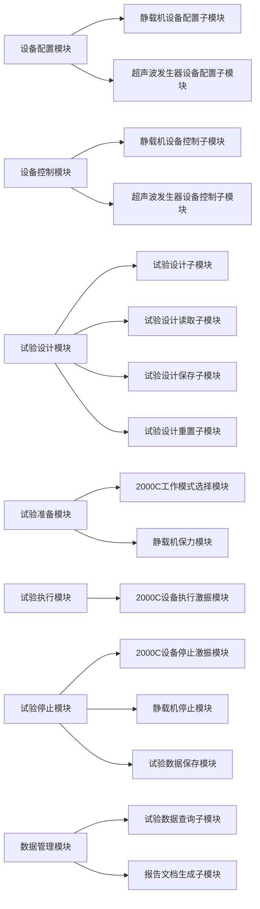
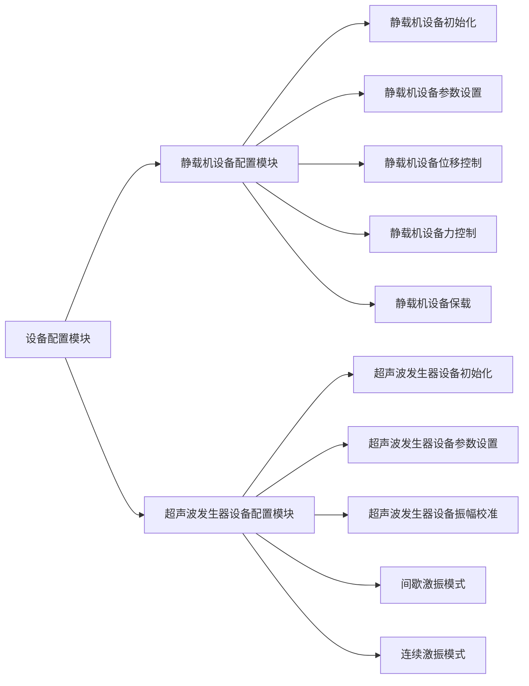
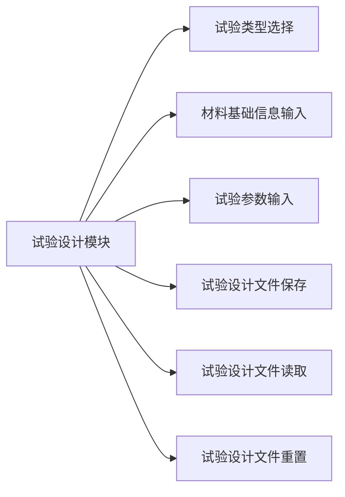
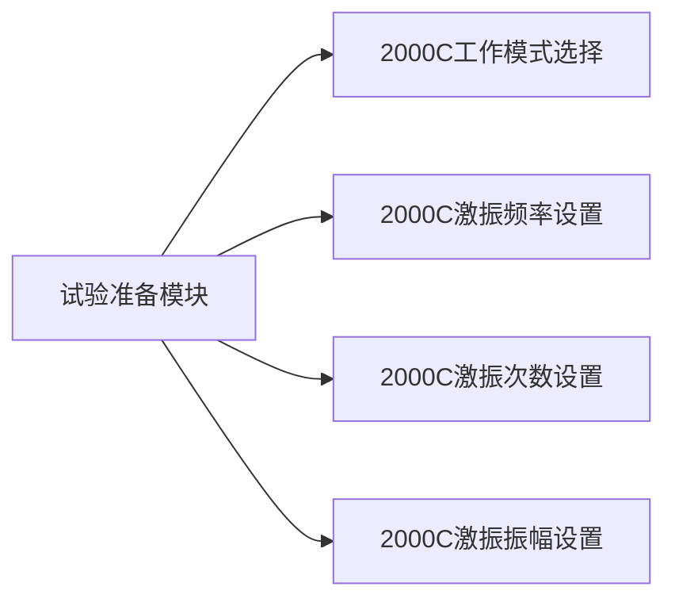
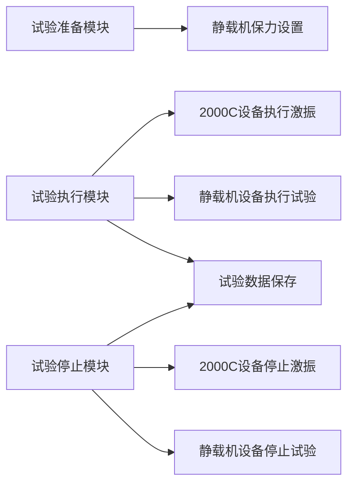
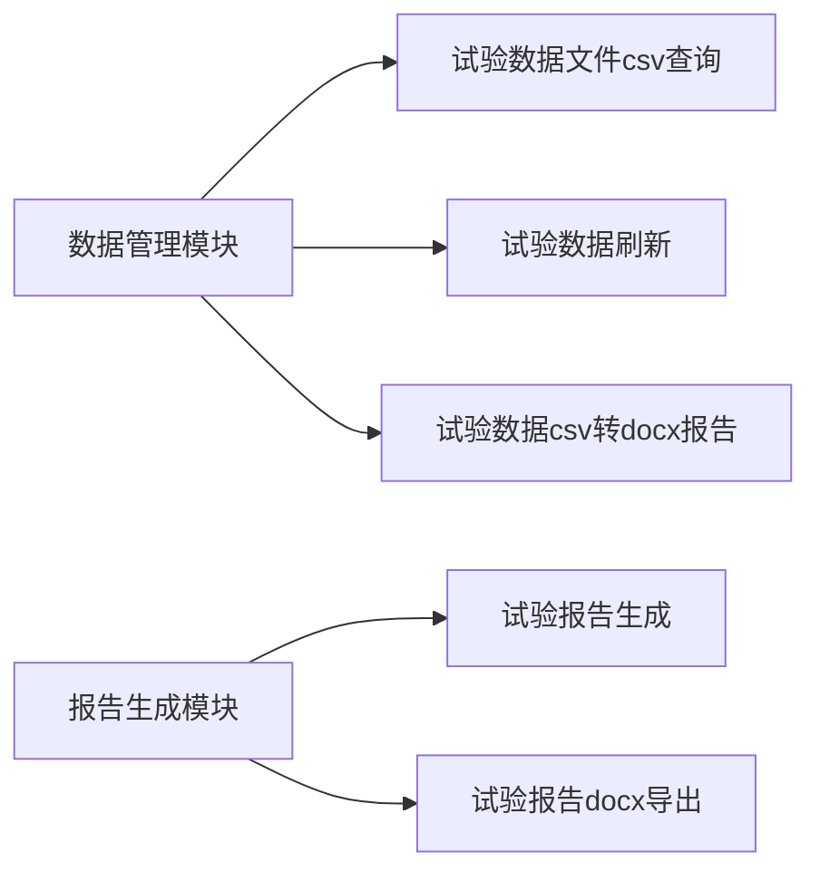

# 超高周疲劳试验控制系统 项目介绍

## 1. 简介

超高周疲劳试验控制系统 是一款用于材料疲劳试验验证自动化的软件，主要用于材料疲劳试验数据的采集、分析和报告生成。
将多个原厂设备的数据采集、分析和报告生成整合到一个系统软件中，提高了工作效率，减少了人为错误。
通过继承多个原厂设备的能力组合，超高周疲劳试验控制系统 具有更强的适应性和扩展性。

## 2. 项目背景

材料疲劳试验是材料力学性能测试的重要环节，通过对材料在不同载荷条件下的疲劳寿命进行测试，可以评估材料的使用寿命和性能。
传统的材料疲劳试验需要人工操作，存在数据采集不准确、数据分析不及时等问题。

终端设备厂商提供了一些试验设备，如静载机、超声波发生器等，这些设备的数据采集、分析和报告生成功能丰富，
但无法满足用户多个设备的整合需求。

1. 静载机设备软件端与2000C超声波发生器软件端无法实现数据的共享和交互，用户需要手动操作，存在数据不准确、操作繁琐等问题。
2. 存在用户需要针对原厂设备需要熟悉不同的操作界面，操作繁琐，数据不统一等问题。
3. 原厂设备软件无法满足用户的自定义需求，如试验报告定制化、数据分析定制化等。

针对用户需求和自定义功能拓展，厂商提供的软件无法满足。
为了解决这些问题，需要一个软件系统来整合多个原厂设备的数据采集、分析和报告生成功能，提高工作效率。

试验设计、试验执行、试验数据分析和报告生成是材料疲劳试验的重要环节，需要一个软件系统来实现自动化。

## 3. 项目目标

多个原厂设备，提供针对试验流程，实现原厂设备集成，试验设计、试验执行、试验数据分析和报告生成功能等关键功能点整合。

**第一阶段整合万测静载机 1.0和2.0版本和赫兹声电2000C超声波发生器，以及用户试验流程的自定义功能。**

## 4. 项目范围

### 4.1 项目模块

- 设备配置模块
- 静载机设备控制模块
- 超声波发生器设备控制模块
- 试验设计模块
- 试验执行模块
- 数据管理模块
- 报告生成模块

模块功能示意图如下：

<!-- 使用graph绘制示意图-->

### 4.2 项目子模块功能

- 设备配置 静载机设备配置 万测静载机 1.0和2.0版本 1.0版本 10KN和20KN两种传感器 串口配置 2.0版本 网络配置
- 设备配置 超声波发生器设备配置 赫兹声电2000C超声波发生器 串口配置
- 设备控制 静载机设备控制 静载机设备初始化 静载机设备参数设置 静载机设备位移控制 静载机设备力控制 静载机设备保载
- 设备控制 超声波发生器设备控制 超声波发生器设备初始化 超声波发生器设备参数设置 超声波发生器设备振幅校准 间歇激振模式 连续激振模式
- 试验设计 试验类型选择 材料基础信息输入 试验参数输入 试验设计文件保存 试验设计文件读取 试验设计文件重置
- 试验准备 2000C工作模式选择 2000C激振频率设置 2000C激振次数设置 2000C激振振幅设置 静载机保力设置
- 试验执行 2000C设备执行激振 静载机设备执行试验 试验数据保存
- 试验停止 2000C设备停止激振 静载机设备停止试验 试验数据保存
- 数据管理 试验数据查询 试验数据导入 试验数据docx导出
- 报告生成 试验报告生成 试验报告docx导出

<!-- 使用graph绘制功能图-->

## 5. 项目进度

- 设备配置模块：已完成
- 静载机设备控制模块：已完成
- 超声波发生器设备控制模块：已完成
- 试验设计模块：已完成
- 试验执行模块：已完成
- 数据管理模块：已完成
- 报告生成模块：已完成

## 6. 项目成果

- 设备配置模块：提供了万测静载机 1.0和2.0版本和赫兹声电2000C超声波发生器的通信地址和参数配置功能。
- 静载机设备控制模块：提供了静载机设备的初始化、参数设置、位移控制、力控制和保载功能。
- 超声波发生器设备控制模块：提供了超声波发生器设备的初始化、参数设置、振幅校准功能。
- 试验设计模块：提供了试验类型选择、材料基础信息和试验参数输入功能。
- 试验执行模块：提供了试验设计文件加载、设备准备、参数初始化、试验开始和试验结束功能。
- 数据管理模块：提供了试验数据查询、导入、导出功能。
- 报告生成模块：提供了试验报告生成、导出功能。

## 7. 项目支持

- 技术支持团队：超高周疲劳试验控制系统 技术支持团队
- 邮箱：[hhool@outlook.com](mailto:hhool@outlook.com)
