# 超高周疲劳控制系统使用说明

## 1. 安装包

anxi-x.x.x-win32.exe 是 超高周疲劳控制系统的安装包，双击启动安装程序，按照提示完成安装。

安装过程中，选择创建桌面快捷方式，安装完成后，桌面会出现 anxi 快捷方式。

## 2. 运行

双击 anxi 快捷方式，启动 超高周疲劳控制系统。

## 3. 卸载

在控制面板中，选择“程序和功能”，找到 anxi 软件，点击“卸载”按钮，按照提示完成卸载。

提示 ：完全卸载包括缓存路径C:\Users\username\AppData\Roaming\anxi 需手动删除

## 4. 使用

超高周疲劳控制系统的使用方法。

### 4.1. 首页和试验工作窗口截图

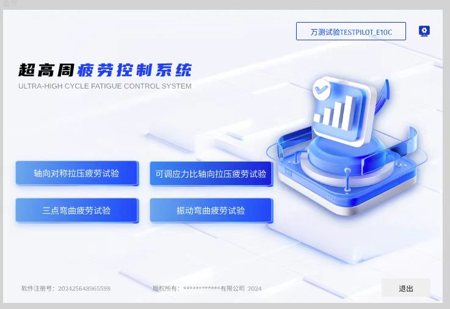
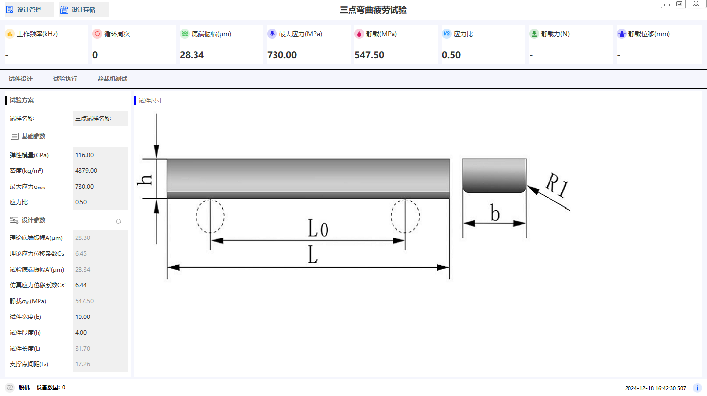

首页界面说明：

| 类型   | 说明                                        | 其他                                                                                 |
| ------ | ------------------------------------------- | ------------------------------------------------------------------------------------ |
| 按钮   | 试验工作页面启动， 点击进入试验工作页面     | 轴向对称拉压疲劳试验，可调应力比轴向拉压疲劳试验，三点弯曲疲劳试验, 振动弯曲疲劳试验 |
| 按钮   | 第三方软件页面启动， 点击进入第三方软件页面 | 万测试验TESTPILOT_E10C                                                               |
| 按钮   | 首页配置， 点击进入首页配置页面             |                                                                                      |
| 按钮   | 退出， 点击退出软件                         |                                                                                      |
| 状态栏 | 显示软件注册号，版权信息                    |                                                                                      |

#### 4.1.1. 首页软件配置

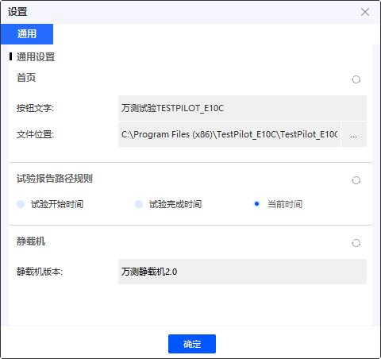

首页配置说明：

| 配置             | 功能                           | 其他                                                                             |
| ---------------- | ------------------------------ | -------------------------------------------------------------------------------- |
| 首页三方软件配置 | 首页按钮名称和三方软件入口路径 | **三方软件路径为绝对路径，配置内容头尾不带引号**                                 |
| 试验报告路径     | 试验报告路径生成规则           | 默认路径为C:\Users\{用户名}\AppData\Roaming\anxi\expreport  目前版本不可修改     |
| 静载机版本       | 静载机1.0, 静载机2.0           | 静载机1.0传感器类型选择，用于静载机1.0的传感器类型选择，根据实际传感器类型选择。 |

##### **试验报告路径生成规则**

试验记录文件生成docx文件在默认路径下追加路径规则选项。

- 试验开始时间 以2000C开始时间为准
- 试验结束时间 以2000C结束时间为准
- 当前时间 以用户将csv文件导出为docx操作的当前时间为准, 默认选项为当前时间

举例：试验开始时间，试验结束时间，当前时间，生成的docx文件名为：20\01\03\2022-01-01-2022-01-02.docx

2022-01-01 为2000C开始时间，2022-01-02 为2000C结束时间，2022\01\03 为用户导出docx文件的时间。

完整路径为：C:\Users\{用户名}\AppData\Roaming\anxi\expreport\20\01\03\2022-01-01-2022-01-02.docx

##### 静载机1.0传感器分类

静载机1.0传感器类型选择，分为10KN和20KN两种传感器类型。

根据实际传感器类型选择，选择后，静载机1.0的传感器类型会根据选择的传感器类型进行配置。

静载机版本:

静载机1.0
静载机2.0
传感器：

10KN
20KN

<!-- impotant warning -->

**静载机1.0传感器类型选择，用于静载机1.0的传感器类型选择，根据实际传感器类型选择。**

### 4.2 试验工作窗口

#### 4.2.1 试验菜单区

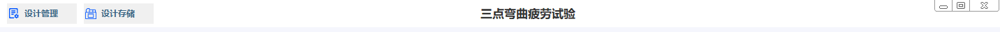

设计管理:

| 菜单     | 说明                                   | 其他 |
| -------- | -------------------------------------- | ---- |
| 设备连接 | 设备连接，连接2000C和静载机            |      |
| 设备断开 | 设备断开，断开2000C和静载机            |      |
| 设备设置 | 设备设置，配置2000C串口和静载机串口    |      |
| 读取方案 | 读取方案，读取试验方案文件             |      |
| 保存方案 | 保存方案，保存试验方案文件             |      |
| 重置方案 | 重置方案，重置当前试验方案为系统默认值 |      |

设计存储:

| 菜单     | 说明                               | 其他 |
| -------- | ---------------------------------- | ---- |
| 试验记录 | 试验记录，转到试验结果存储管理窗口 |      |

#### 4.2.2 试验信息区

<!-- 插入试验信息截图 指定显示内容，图片区域-->

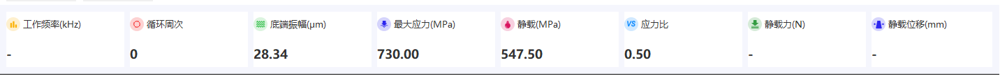

用于显示当前试验过程中关键信息展现

| 条目     | 说明           | 其他                                            |
| -------- | -------------- | ----------------------------------------------- |
| 工作频率 | 试验工作频率   | 2000C红外发生器实时频率展示                     |
| 循环次数 | 试验激振次数   | 2000C红外发生器试验进行中的实际激振次数总数显示 |
| 底端振幅 | 底端振幅大小值 | 2000C红外发生器实时底端振幅展示                 |
| 最大应力 | 最大应力大小值 |                                                 |
| 静载     | 当前静载大小值 |                                                 |
| 应力比   | 应力比大小值   |                                                 |
| 静载力   | 静载力大小值   | 静载机施加力大小                                |
| 静载位移 | 静载位移大小值 | 静载机位移大小                                  |

#### 4.2.3 试验方案设计页面

##### 4.2.3.1 试验方案设计区

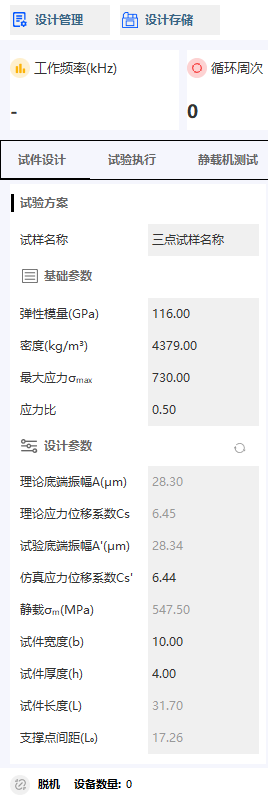

参数区：

| 分类     | 说明                       | 其他                                                                                      |
| -------- | -------------------------- | ----------------------------------------------------------------------------------------- |
| 试样名称 | 试样名称，输入试样名称     |                                                                                           |
| 基础参数 | 试验基础参数，试验基础参数 |                                                                                           |
| 设计参数 | 试验设计参数，试验设计参数 | 设计参数右侧刷新按钮，用于根据输入值结合**振幅校准**计算相应的底端振幅 最大应力，静载等值 |

##### 4.2.3.2 试件尺寸展示区

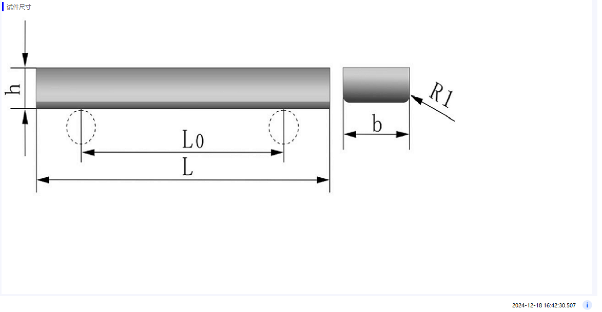

用于当前试验材料样式和对应于设计参数的符号示意图。

#### 4.2.4 试验执行页面

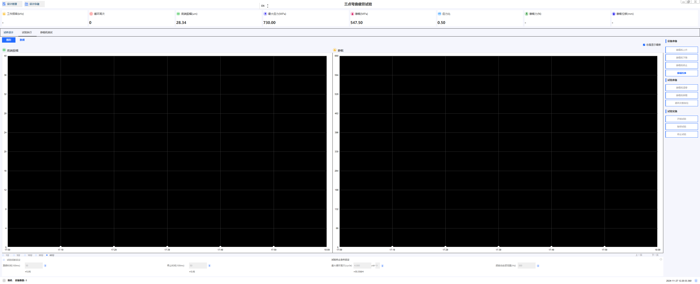

试验执行页面，包括直方图和数据两个界面。

#### 4.2.5 静载机测试页面

静载机测试页面，静载机详细信息展示。辅助用户进行静载机的基本通信测试和工作状态展示。

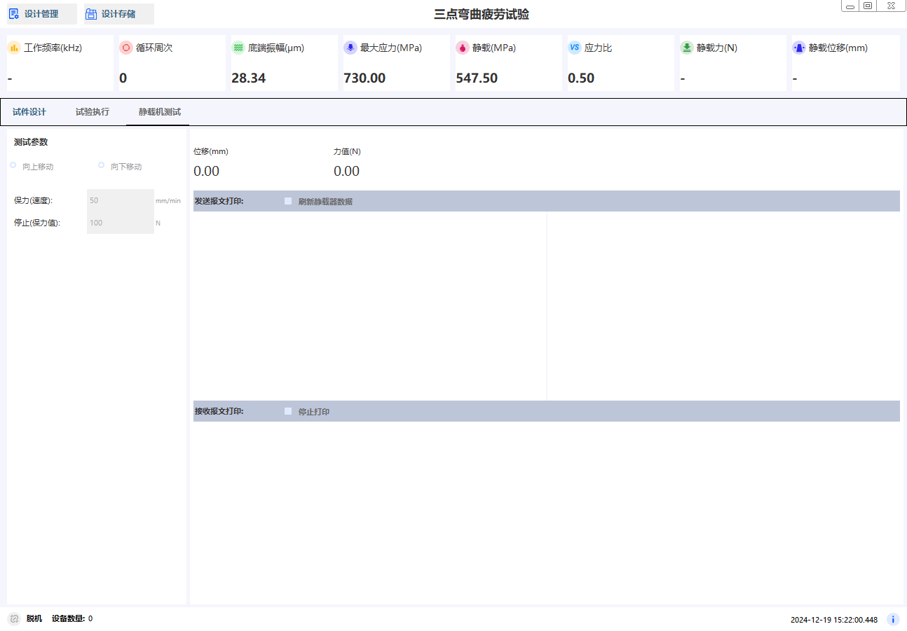

静载机测试页面，包括静载机基本信息，静载机工作状态，静载机通信状态。

### 4.3 设备配置

#### 4.3.1 正确配置2000C串口和静载机串口

在 超高周疲劳控制系统 中，点击“设计管理”菜单，选择“设备设置”，配置2000C串口和静载机串口。

- 静载机1.0

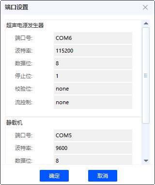

- 静载机2.0

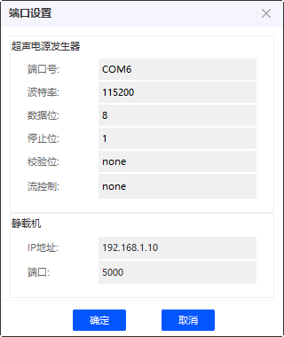

##### 4.3.1.1 正确配置2000C串口参数，其他参数保持默认，主要更改串口号，可依据实际情况更改。

通过系统设备管理器查看2000C串口号，更改超高周疲劳控制系统中的2000C串口号。

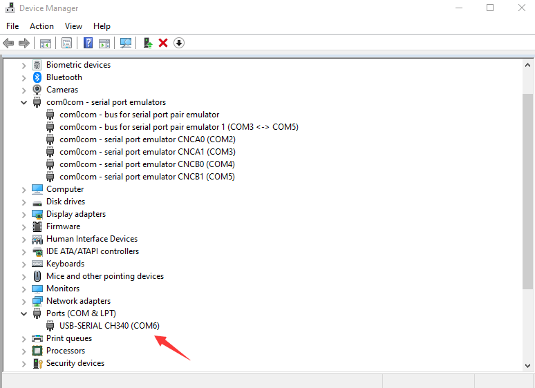

##### 4.3.1.2 正确配置静载机串口参数，其他参数保持默认，主要更改串口号，可依据实际情况更改。

通过系统设备管理器查看静载机串口号，更改超高周疲劳控制系统中的静载机串口号（静载机1.0）或 静载机IP地址（静载机2.0）。

##### 4.3.1.3 正确配置2000C串口和静载机串口后，点击“设计管理”菜单，选择“设备连接”，点击。

成功连接后，超高周疲劳控制系统会在状态栏显示“设备连接成功”和数量。

### 4.4. 设计管理

在**设计管理**中，可以重置（重置方案）、导出-（保存方案）、导入-（读取方案）设计方案文件。

以三点弯曲为例：

- 重置设计方案，菜单 设计管理-》重置方案按钮，重置当前设计方案为系统默认值。
- 保存设计方案，菜单 设计管理-》保存方案按钮，保存当前设计方案为文件。
- 读取设计方案，菜单 设计管理-》读取方案按钮，读取设计方案文件。

提示: 不同设计类型，只能打开对应设计类型的设计文件。

方案设计结果刷新，点击设计参数右侧刷新按钮，用于根据输入值结合**振幅校准**计算相应的底端振幅 最大应力，静载等值。

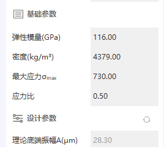

**振幅校准**

用于拟合线性函数，试件设计->底端振幅->2000C功率值, 用于校准底端振幅和2000C功率值的关系。

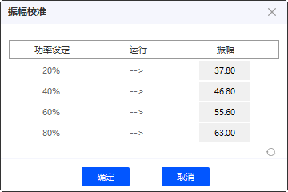

### 4.5. 试验执行

点击“试验执行”按钮，进入试验执行界面。

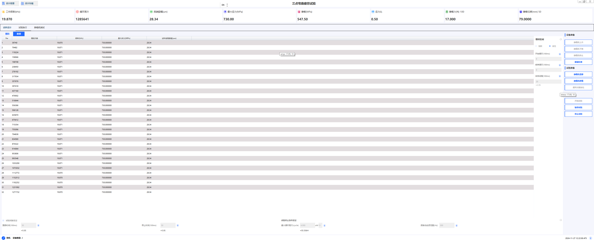

三点弯曲试验执行界面，包括直方图和数据两个界面。

1. 直方图界面，显示试验过程中采样数据的直方图。
2. 数据界面，显示试验过程中的采样数据。

#### 4.5.1. 2000C持续和间歇试验执行设置界面

**概述：** 2000C持续和间歇试验执行设置界面，用于控制2000C持续和间歇试验的开始和结束时间，以及试验参数设置。

- 勾选间歇试验，设置间歇试验参数，间歇试验开始，间武试验结束。进行间歇试验。
- 试验终止条件，到达最大循环次数或者频率动态波动范围，达到终止条件后，试验停止。

#### 4.5.2. 2000C数据采样频率设置

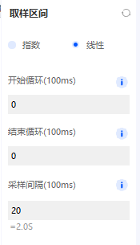

**概述：** 2000C数据采样频率设置，用于控制2000C采样数据的开始和结束时间，以及采样间隔时间。采样数据显示在数据界面。

- 开始循环：2000C开始工作后延时多长时间开始循环采样数据。用于试验开始后延时采样。暂停试验-》继续试验时，不使用此规则。
- 结束循环: 2000C实际采样累加时长打到结束循环时间后，停止采样数据。
- 采样间隔: 2000C采样数据的间隔时间，单位100ms，即10为1s。

**提示：** 采样间隔 在间歇试验中，采样间隔时间应小于激振时间。

#### 4.5.3. 2000C试验执行实施

设备准备 - 静载机上升，静载机下降，静载机停止。

| 设备准备   | 说明                                                | 其他 |
| ---------- | --------------------------------------------------- | ---- |
| 静载机上升 | 静载机上升，上升距离无限制。用于离试件较远距离作业  |      |
| 静载机下降 | 静载机下降，下降距离无限制。 用于离试件较远距离作业 |      |
| 静载机停止 | 静载机停止，停止后，静载机保持在当前位置。          |      |

试验准备 - 静载机清零，静载机保载，循环次数复位。

| 试验准备     | 说明                                     | 其他                                             |
| ------------ | ---------------------------------------- | ------------------------------------------------ |
| 静载机清零   | 静载机清零，清零后，静载机保持在零位。   |                                                  |
| 静载机保载   | 静载机保持在设定的载荷位置。             | 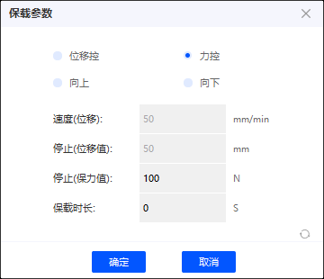 |
| 循环次数复位 | 循环次数复位，复位后，循环次数从零开始。 |                                                  |

保载参数- 位移控，力控。

| 保载参数 | 说明                           | 其他                               |
| -------- | ------------------------------ | ---------------------------------- |
| 位移控   | 速度(位移)，停止（位移值）有效 | 已制定的速度，移动到停止位移值     |
| 力控     | 停止（力值）有效，保载时长     | 力值到达力值，并按保载时间持续保持 |

试验执行 - 试验开始，试验暂停，试验继续，试验停止。

| 试验执行 | 说明                                    | 其他 |
| -------- | --------------------------------------- | ---- |
| 试验开始 | 调整静载载荷，试验开始， 2000C 开始工作 |      |
| 试验暂停 | 试验暂停，静载机保持载荷，2000C停止工作 |      |
| 试验继续 | 试验继续，静载机保持载荷，2000C继续工作 |      |
| 试验停止 | 试验停止，静载机保持载荷，2000C停止工作 |      |

试验间断设定 - 试验间断设定，试验间断开始，试验间断结束。 用于试验执行过程中的间断逻辑配置。

| 试验间断设定 | 说明                                 | 其他 |
| ------------ | ------------------------------------ | ---- |
| 试验间断设定 | 试验间断设定，设定间断时间，间断次数 |      |
| 试验间断开始 | 试验间断开始，间断时间到，试验开始   |      |
| 试验间断结束 | 试验间断结束，间断时间到，试验继续   |      |

试验终止条件 - 最大循环次数，频率动态波动范围，达到终止条件后，试验停止。

| 试验终止条件     | 说明                                       | 其他                                                 |
| ---------------- | ------------------------------------------ | ---------------------------------------------------- |
| 最大循环次数     | 达到最大循环次数后，试验停止               | 试验间断勾选后，次数是统计的激振次数总和，不包括暂停 |
| 频率动态波动范围 | 频率动态波动范围，达到设定范围后，试验停止 | 数据列表第一条的频率为比对参数                       |

### 4.6. 试验数据

在试验执行界面，试验结束后，点击“试验数据”按钮，进入试验数据界面。

试验数据界面

配置参数- 开始时间，结束时间，采样频率。

| 试验数据 | 说明                                                                                   |
| -------- | -------------------------------------------------------------------------------------- |
| 开始时间 | 试验数据开始时间，默认测试即采样数据                                                   |
| 结束时间 | 试验数据结束时间，默认持续进行， 终止条件为 上述试验终止条件或用户单击·停止试验·按钮 |
| 采样频率 | 试验数据采样频率，默认2秒                                                              |

数据取样方式 - 指数取样，线性取样。

| 数据取样方式 | 说明                                                          |
| ------------ | ------------------------------------------------------------- |
| 指数取样     | 指数取样，数据取样方式，指数增长， 0.1s 1s 10s 100s ...       |
| 线性取样     | 线性取样，根据采样频率，数据取样方式，线性增长， 2s 4s 6s ... |

数据保存 - 试验因用户单击·停止试验·按钮终止或触发终止条件，数据自动保存在系统C:\Users\{用户名}\AppData\Roaming\anxi\expdata文件夹。

提示: 菜单 设计存储->试验数据。

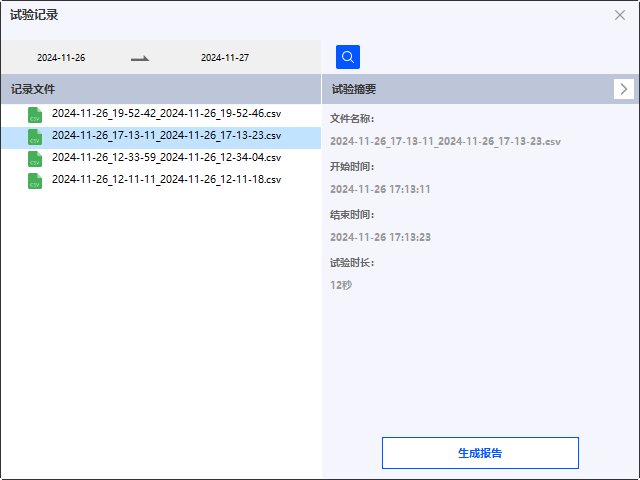

- 试验数据记录，显示试验数据csv文件记录列表。
- 试验摘要，显示左侧选中csv文件的试验数据文件摘要信息。
- 搜索框按日期条件搜索数据记录文件。
- 生成报告，生成选中csv文件的试验数据报告word文档。打开报告文件夹。

### 4.7. 试验报告

在试验数据界面，点击“生成报告”按钮，生成试验数据报告word文档。

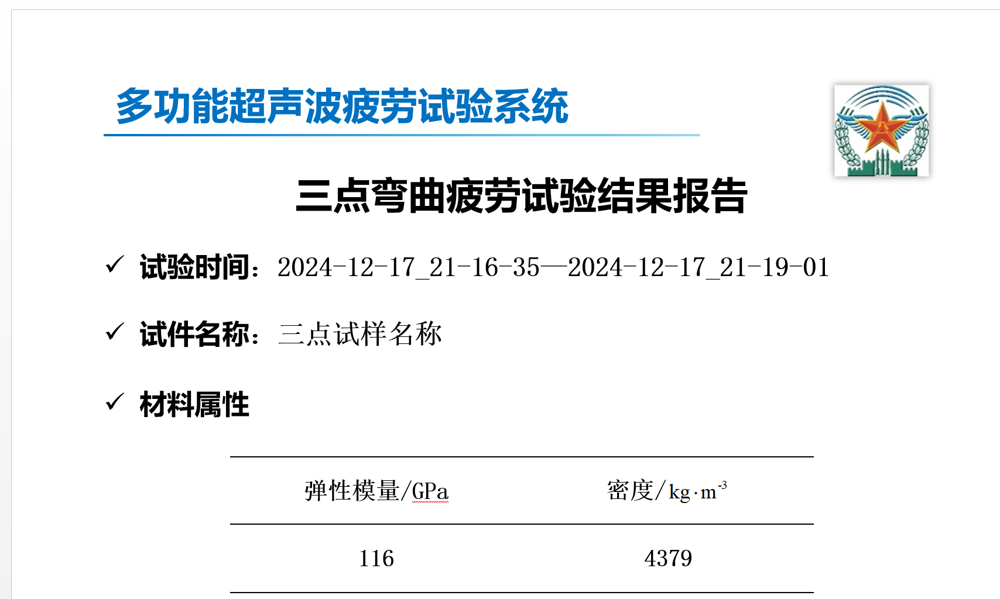

生成报告后，打开报告文件夹，查看生成的试验数据报告word文档。
