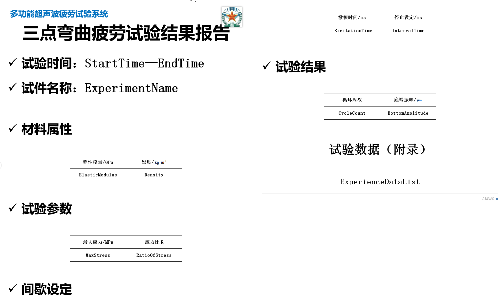

# 软件架构说明书

## 1. 简介

超高周疲劳控制系统架构说明书用于描述软件的总体架构设计，包括软件的功能模块、组件、接口、数据结构等内容，是软件设计的重要文档之一。

帮助开发人员理解软件的设计思路和实现方法，为软件的开发、测试和维护提供参考。

软件源码地址：

[https://wwww.github.com/hhool/anxi](https://www.github.com/hhool/anxi)

软件编译说明书：

[https://github.com/hhool/anxi/blob/main/README.md](https://github.com/hhool/anxi/blob/main/README.md)

## 2. 系统架构

软件的总体架构和主要组件。

### 2.1 架构运行环境

- 硬件环境：PC机，串口设备，网络设备。
- 软件环境：Windows 7+ 操作系统，串口通信库，网络通信库。
- 开发环境：Visual Studio 2015 +，C#，.NET Framework 3.5+。
- 数据库环境：SQLite。
- 通信协议：串口通信协议，RS485转USB2.0+，网络通信协议（TCP/IP)。
- 界面设计：DuiLib。

### 2.2 架构设计

软件的总体架构设计如下：

- 试验设计模块：用于试验设计的功能模块。
- 试验执行模块：用于试验执行的功能模块。
- 静载机测试模块：用于静载机测试的功能模块。

软件的主要组件如下：

- 试验设计组件：用于试验设计的组件。

  主要包括:

  试验设计界面，振幅校准用于试验设计算法。
- 试验执行组件：用于试验执行的组件。

  主要包括：

  视图组件：数据采集图表，数据采集表格，试验参数设置界面，试验执行界面。

  控制组件：试验开始，试验暂停，试验继续，试验停止。

  数据处理组件：试验数据处理展现。
- 静载机测试组件：用于静载机测试的组件。

  主要包括:

  静载机测试界面，静载机测试数据采集。
- 串口通信组件：用于串口通信的组件。

  主要包括：

  静载机： 通信地址配置，静载机通信打开，静载机通信读写，静载机通信关闭。

  2000C：  超声波发生器通信地址配置，2000C超声波发生器通信打开，2000C超声波发生器通信读写，2000C超声波发生器通信关闭。
- 网络通信组件：用于网络通信的组件。

  主要包括：

  静载机2.0：  静载机通信地址配置，静载机通信打开，静载机通信读写，静载机通信关闭。
- 数据库组件：用于数据库操作的组件。用于试验数据的存储和查询。用于试验数据报表的生成。

  主要包括：

  数据库连接，数据库操作，数据库查询，数据库存储。
- 日志组件：用于日志记录的组件。用户不可见，软件运行时记录日志。

  主要包括：

  日志记录，日志查询，日志存储。用于软件的操作日志和异常日志的记录。
- 异常处理组件：用于异常处理的组件。用户不可见，软件运行时记录异常。

  主要包括：

  异常捕获，异常处理，异常记录。用于软件的异常情况的处理。
- 试验报告生成组件：用于试验报告生成的组件。试验报告模板，试验报告生成。

  主要包括：

  试验报告模板，试验报告生成，试验报告导出，试验报告程序todocx。

### 2.3 架构设计原则

软件的设计应该遵循以下原则：
采用 MVC 设计模式，将软件的功能分为 Model（数据模型）、View（视图）、Controller（接口控制） 三个部分，实现功能的分离和解耦。

- 模块化：软件的功能模块应该独立，模块之间的耦合度应该尽量降低。
- 可扩展：软件的功能应该支持扩展，新的功能模块应该容易添加。
- 可维护：软件的代码应该易于维护，代码的可读性和可维护性应该高。
- 可测试：软件的功能应该易于测试，测试用例应该覆盖所有的功能模块。

### 2.4 架构框架

示意图如下：


## 3. 模块设计

### 3.1 试验设计模块

试验设计模块的功能、接口和内部结构。

#### 3.1.1 数据结构模型接口定义

三点弯曲疲劳试验为例，试验设计模块的功能如下：

输入：

1. 材料基础信息，设计参数。
2. 振幅校准数据，拟合振幅和功率值线性关系。

算法：

1. 三点弯曲疲劳试验设计算法。

输出：

1. 试验设计结果，试验振幅，频率等参数。算法计算结果用于试验执行2000C超声波发生器的试验参数设置。

结构示意图如下：


数据流程如下：

1. 用户输入材料基础信息，设计参数。
2. 用户输入振幅校准数据，拟合振幅和功率值线性关系。
3. 试验设计算法计算试验设计结果，试验振幅，频率等参数。
4. 试验设计结果用于试验执行2000C超声波发生器的试验参数设置。

数据流示意图如下：


模块接口设计如下：

试验设计头信息：

1. 针对输入材料基础信息接口设计如下：

```cpp
struct ExpDesignHeader {

  // @brief 试验设计类型 @see kSolutionName_Axially_Symmetrical ...etc
  // @brief The exp design type @see kSolutionName_Axially_Symmetrical ...etc
  int32_t solution_type_;
  // @brief 试验设计版本
  // @brief The exp design version
  int32_t version_;
  // @brief 试验设计名称
  // @brief The exp design name
  uint8_t name_[256];
  // @brief 试验设计日期 NTP时间戳
  // @brief The exp design date NTP timestamp
  int64_t date_;
  // @brief 试验设计版权
  // @brief The exp design copy right
  uint8_t copy_right_[256];
}
```

试验设计基础参数：

```cpp
struct ExpDesignBaseParam {

   // @brief 材料名称
  // @brief The material name
  uint8_t material_name_[256];
  // @breif 弹性模量 GPa 1GPa=1000MPa
  // @brief The elastic modulus GPa 1GPa=1000MPa
  double f_elastic_modulus_GPa_;
  // @brief 密度 kg/m^3
  // @brief The density kg/m^3
  double f_density_kg_m3_;
  // @brief 应力最大值 MPa
  // @brief The max stress MPa
  double f_max_stress_MPa_;
  // @brief 应力比
  // @brief The stress ratio
  double f_stress_ratio_;
}
```

轴向对称拉压疲劳试验设计参数：

```cpp
struct ExpDesignParamAxially : public ExpDesignBaseParam{

}
```

可调应力比轴向拉压疲劳试验设计参数：

```cpp
struct ExpDesignParamAxiallyAdjustable : public ExpDesignBaseParam{

}
```

三点应力疲劳试验设计参数：

```cpp
struct ExpDesignParamTh3pointBending : public ExpDesignBaseParam{

}
```

振动弯曲疲劳试验设计参数：

```cpp
struct ExpDesignParamBendingVibration : public ExpDesignBaseParam{

}
```

振幅校准数据接口设计如下：

- 振幅校准数据拟合线性函数：y = kx + b，其中 **y 为功率值，x 为振幅值**。
- **y 功率值用于超声波发生器的功率输出，x 振幅值用于超声波发生器的振幅控制**。
- 拟合函数采用最小二乘法，拟合结果为振幅和功率值的线性关系。

拟合函数采用C实现，接口设计如下：

```cpp
// @brief 振幅校准拟合函数
// @brief Amplitude calibration fitting function
// @param x 振幅值
// @param y 功率值
// @param n 数据点个数
// @param a 拟合结果斜率
// @param b 拟合结果截距
void LineFit(float x[], float y[], int n, float* a, float* b);
```

#### 3.1.2 试验设计存储方式

试验设计存储方式以xml格式存储，试验设计头信息，试验设计基础参数，试验设计结果等信息存储。

已文件存储方式存储，文件名以试验设计名称命名，文件后缀为xml。

软件支持试验设计的导入导出，用户可以通过试验设计的导入导出功能，方便的进行试验设计的保存和恢复。

三点弯曲疲劳试验，试验设计存储方式如下：

```xml
<?xml version="1.0" encoding="utf-8"?>
<solution>
    <header>
        <solution_type>2</solution_type>
        <version>1</version>
        <name>三点试样名称</name>
    </header>
    <base_param>
        <material_name></material_name>
        <elastic_modulus>116.000000</elastic_modulus>
        <density>4379.000000</density>
        <max_stress>730.000000</max_stress>
        <stress_ratio>0.500000</stress_ratio>
    </base_param>
    <result type="th3point">
        <f_theory_eamplitude>28.300000</f_theory_eamplitude>
        <f_theory_dc_stress_MPa>6.450000</f_theory_dc_stress_MPa>
        <f_eamplitude>28.340000</f_eamplitude>
        <f_dc_stress_MPa>6.440000</f_dc_stress_MPa>
        <f_static_load_MPa>547.500000</f_static_load_MPa>
        <f_specimen_width_B>10.000000</f_specimen_width_B>
        <f_specimen_thickness_h>4.000000</f_specimen_thickness_h>
        <f_specimen_length_L>31.700000</f_specimen_length_L>
        <f_support_distance_L0>17.260000</f_support_distance_L0>
    </result>
</solution>
```

轴向对称拉压疲劳试验，试验设计存储方式如下：

```xml
<?xml version="1.0" encoding="utf-8"?>
<solution>
    <header>
        <solution_type>0</solution_type>
        <version>1</version>
        <name>轴向试样名称</name>
    </header>
    <base_param>
        <material_name>钛合金</material_name>
        <elastic_modulus>116.000000</elastic_modulus>
        <density>4379.000000</density>
        <max_stress>208.000000</max_stress>
        <stress_ratio>-1.000000</stress_ratio>
    </base_param>
    <result type="axially">
        <f_eamplitude>15.000000</f_eamplitude>
        <f_dc_stress_MPa>13.570000</f_dc_stress_MPa>
        <f_exp_section_radius_R2>5.000000</f_exp_section_radius_R2>
        <f_parallel_section_radius_R1>1.500000</f_parallel_section_radius_R1>
        <f_transition_section_radius_R0>22.300000</f_transition_section_radius_R0>
        <f_transition_section_length_L1>12.000000</f_transition_section_length_L1>
        <f_parallel_section_length_L0>2.000000</f_parallel_section_length_L0>
        <f_exp_section_length_L2>15.000000</f_exp_section_length_L2>
    </result>
</solution>
```

可调应力比轴向拉压疲劳试验，试验设计存储方式如下：

```xml
<?xml version="1.0" encoding="utf-8"?>
<solution>
    <header>
        <solution_type>1</solution_type>
        <version>1</version>
        <name>可调试样名称</name>
    </header>
    <base_param>
        <material_name>铝合金</material_name>
        <elastic_modulus>116.000000</elastic_modulus>
        <density>4379.000000</density>
        <max_stress>900.000000</max_stress>
        <stress_ratio>0.350000</stress_ratio>
    </base_param>
    <result type="stresses">
        <f_eamplitude>20.800000</f_eamplitude>
        <f_dc_stress_MPa>14.060000</f_dc_stress_MPa>
        <f_exp_section_radius_R2>5.000000</f_exp_section_radius_R2>
        <f_parallel_section_radius_R1>1.500000</f_parallel_section_radius_R1>
        <f_transition_section_radius_R0>22.000000</f_transition_section_radius_R0>
        <f_transition_section_length_L1>11.900000</f_transition_section_length_L1>
        <f_parallel_section_length_L0>1.700000</f_parallel_section_length_L0>
        <f_exp_section_length_L2>15.700000</f_exp_section_length_L2>
        <f_static_load_MPa>607.500000</f_static_load_MPa>
    </result>
</solution>

```

振动弯曲疲劳试验，试验设计存储方式如下：

```xml
<?xml version="1.0" encoding="utf-8"?>
<solution>
    <header>
        <solution_type>3</solution_type>
        <version>1</version>
        <name>振动试样名称</name>
    </header>
    <base_param>
        <material_name></material_name>
        <elastic_modulus>116.000000</elastic_modulus>
        <density>4379.000000</density>
        <max_stress>208.000000</max_stress>
        <stress_ratio>-1.000000</stress_ratio>
    </base_param>
    <result type="vibration">
        <f_eamplitude>8.500000</f_eamplitude>
        <f_dc_stress_MPa>24.500000</f_dc_stress_MPa>
        <f_specimen_length_parallel_section_L1>3.700000</f_specimen_length_parallel_section_L1>
        <f_specimen_radius_arc_R1>3.000000</f_specimen_radius_arc_R1>
        <f_specimen_radius_transition_R2>1.000000</f_specimen_radius_transition_R2>
        <f_thickness_clamping_d1>5.200000</f_thickness_clamping_d1>
        <f_thickness_exp_section_L0_d2>3.200000</f_thickness_exp_section_L0_d2>
    </result>
</solution>

```

### 3.2 试验执行模块

试验执行模块的功能、接口和内部结构。

试验执行模块的功能如下：

- 设备准备：静载机设备地址配置，打开，读写配置。 2000C设备地址配置，打开，读写配置。 静载机设备位移控制。
- 试验准备：静载机清零，循环次数清零，静载机保载。
- 试验实施：开始试验，暂停试验，继续试验，停止试验。
- 试验结束：试验数据存储，试验报告生成。

试验执行流程示意图如下：


#### 3.2.1 设备准备

设备准备接口设计实现原则：

- 设备对象接口类。设备接口设计应该支持多种设备的接入，包括静载机设备和超声波发生器设备。
- 设备通信接口类。设备通信接口应该支持串口通信和网络通信，支持设备的打开，读写，关闭等操作。
- 设备静载机辅助方法类。设备辅助方法应该支持设备的初始化，销毁释放，位移控制，清零，保载等操作。
- 设备超声波发生器辅助方法类。设备辅助方法应该支持设备的c初始化，销毁释放，振幅校准，功率控制等操作。

设备准备结构示意图如下：


设备对象接口类设计如下：

```cpp
class DeviceNode {};

class DeviceComListener;
class DeviceComInterface {
 public:
  /// @brief  Add listener
  /// @param listener  listener
  virtual void AddListener(DeviceComListener* listener) = 0;
  /// @brief  Remove listener
  /// @param listener  listener
  virtual void RemoveListener(DeviceComListener* listener) = 0;

 public:
  virtual void AttachDeviceNode(DeviceNode* device) { device_ = device; }
  virtual void DetachDeviceNode(DeviceNode*) { device_ = nullptr; }
  virtual DeviceNode* Device() { return device_; }

 private:
  DeviceNode* device_;

 public:
  /// @brief  Open the device com
  /// @return int32_t 0 success, non-zero fail
  virtual int32_t Open(const ComPortDevice& com_port) = 0;
  /// @brief  Check the device com is opened
  /// @return bool true opened, false not opened
  virtual bool isOpened() = 0;
  /// @brief  Close the device com
  virtual void Close() = 0;
  /// @brief  Read data from the device com
  /// @param buffer  data buffer
  /// @param size  data buffer size
  /// @return int32_t  read data size
  virtual int32_t Read(uint8_t* buffer, int32_t size) = 0;
  /// @brief  Write data to the device com
  /// @param buffer  data buffer
  /// @param size  data buffer size
  /// @return int32_t  write data size
  virtual int32_t Write(const uint8_t* buffer, int32_t size) = 0;
  /// @brief  Write data to the device com and read data from the device com
  /// @param write_buffer  write data buffer
  /// @param write_size  write data buffer size
  /// @param read_buffer  read data buffer
  /// @param read_size  read data buffer size
  /// @return int32_t  read data size
  virtual int32_t WriteRead(const uint8_t* write_buffer,
                            int32_t write_size,
                            uint8_t* read_buffer,
                            int32_t read_size) = 0;
};

```

静载机设备接口设计如下：

```cpp
// @brief 静载机设备接口定义
// @brief The static load machine device interface definition

struct stload_api {
  /// @brief load hardware parameters
  /// @param nMachineType the machine type
  /// @return BOOL
  LoadHareWareParameters load_hardware_parameters;
  /// @brief get load sensors
  /// @return the load sensors
  GetLoadSensors get_load_sensors;
  /// @brief get extensions
  /// @return the extensions
  GetExtensions get_extensions;
  /// @brief get extend sensors
  /// @return the extend sensors
  GetExtendSensors get_extend_sensors;
  /// @brief open device
  /// @param uUnit the unit
  /// @return BOOL
  OpenDevice open_device;
  /// @brief open device lan
  /// @param IpAddress the ip address
  /// @param nPort the port
  /// @return BOOL
  OpenDeviceLAN open_device_lan;
  /// @brief close device
  /// @return BOOL
  CloseDevice close_device;
  /// @brief on line the device
  /// @param channelNo the channel no
  /// @param nLoadIndex the load index
  /// @param nExtensionIndex the extension index
  /// @param nExtendIndex the extend index
  /// @param rate the rate
  /// @param MachineType the machine type
  /// @param DTCType the dtc type
  /// @param sensorPosition the sensor position
  /// @param TestSpace the test space
  /// @param dataBlockSize the data block size
  /// @param isAE the is AE
  /// @return BOOL
  OnLine on_line;
  /// @brief off line the device
  /// @return BOOL
  OffLine off_line;
  /// @brief close the device
  /// @return BOOL
  EndRead end_read;
  /// @brief before get sample
  /// @return BOOL
  BeforeGetSample before_get_sample;
  /// @brief after get sample
  /// @return BOOL
  AfterGetSample after_get_sample;
  /// @brief set the sector correction
  /// @param channel the channel
  /// @param corr the correction
  /// @return BOOL
  SetSectCorrA set_sect_corr_a;
  /// @brief set the resolve
  /// @param channel the channel
  /// @param resolve the resolve
  /// @param norinal the norinal
  /// @return BOOL
  SetResolve set_resolve;
  /// @brief set the dest window
  /// @param dest_wnd the dest window
  /// @return BOOL
  SetDestWnd set_dest_wnd;
  /// @brief get the load
  /// @return the load
  GetLoad get_load;
  /// @brief get the position
  /// @return the position
  GetPosi get_posi;
  /// @brief get the extension
  /// @return the extension
  GetExtn get_extn;
  /// @brief get the extension one
  /// @return the extension one
  GetExt1 get_ext1;
  /// @brief get the test time
  /// @return the test time
  GetTestTime get_test_time;
  /// @brief get the test status
  /// @return the test status
  GetTestStatus get_test_status;
  /// @brief tare the load
  /// @return BOOL
  TareLoad tare_load;
  /// @brief tare the position
  /// @return BOOL
  TarePosi tare_posi;
  /// @brief tare the extension
  /// @return BOOL
  TareExtn tare_extn;
  /// @brief tare the extension one
  /// @return BOOL
  TareExt1 tare_ext1;
  /// @brief tare the test time
  /// @return BOOL
  TareTime tare_time;
  /// @brief carry the pid
  /// @param channel the channel
  /// @param Kp the Kp
  /// @param Ki the Ki
  /// @param Kd the Kd
  /// @return BOOL
  CarryPID carry_pid;
  /// @brief set the test dir
  /// @param dir the dir
  /// @return BOOL
  SetTestDir set_test_dir;
  /// @brief carry the 200
  /// @param control the control
  /// @param end the end
  /// @param speed the speed
  /// @param value the value
  /// @param threshold the threshold
  /// @param priority the priority
  /// @param dir the dir
  /// @param keepvalue the keep value
  /// @param keepdatum the keep datum
  /// @param TestModle the test modle
  /// @return BOOL
  Carry200 carry_200;
  /// @brief carry the 210
  /// @param lOpen the lOpen
  /// @return BOOL
  Carry210 carry_210;
  /// @brief stop the run
  /// @return BOOL
  StopRun stop_run;
};
```

2000C超声波发生器设备接口设计如下：

```cpp
// @brief 2000C超声波发生器设备接口定义
// @brief The 2000C ultrasonic generator device interface definition
class UltraDevice :  public DeviceNode {
   /// @brief  Get port device interface
  /// @return port device interface
  DeviceComInterface* GetPortDevice();
  /// @brief  Open device utrasonic
  /// @param com_settings  com settings
  /// @return success 0, failed -1
  int32_t Open(const anx::device::ComSettings& com_settings);
  /// @brief  Close device utrasonic
  /// @return void
  void Close();
  /// @brief  Check device is open
  /// @return true is open, false is close
  bool isOpened();
  /// @brief  Start ultra
  /// send: 01 05 00 02 FF 00 2D FA
  /// response: 01 05 00 02 FF 00 2D FA
  /// @return success 0, failed -1
  int32_t StartUltra();
  /// @brief  Stop ultra
  /// send: 01 05 00 02 00 00 8C 0A
  /// response: 01 05 00 02 00 00 8C 0A
  /// @return success 0, failed -1
  int32_t StopUltra();
  /// @brief  Check ultra is started
  /// @return true is started, false is stoped
  bool IsUltraStarted();
  /// @brief  Get fault code
  /// send: 01 04 00 02 00 01 90 0A
  /// response: 01 04 02 00 00 B9 30
  /// value is 0x0000 means no fault
  /// @return fault code or 0 means no fault
  int32_t GetFaultCode();
  /// @brief  Get current freq
  /// send: 01 04 00 01 00 01 60 0A
  /// response: 01 04 02 4D 97 CD CE
  /// value is 0x4D97 = 19863
  int32_t GetCurrentFreq();
  /// @brief  Get current power
  /// send: 01 04 00 00 00 01 31 CA
  /// response: 01 04 02 00 2A 38 EF
  /// value is 0x002A = 42
  /// @return current power or error < 0
  int32_t GetCurrentPower();
  /// @brief  Set ultra amplitude [20, 100]
  /// send: 01 06 00 18 00 14 90 C2
  /// receive: 01 06 00 18 00 14 90 C2
  /// amplitude is 0x14 = 20
  /// @param amplitude  [20, 100]
  /// @return success 0, failed -1
  int32_t SetAmplitude(int32_t amplitude);
  /// @brief  Get ultra amplitude [20, 100]
  /// send: 01 03 00 18 00 01 04 0D
  /// receive: 01 03 02 00 14 B8 4B
  /// amplitude is 0x14 = 20
  /// @return amplitude [20, 100] or error < 0
  int32_t GetAmplitude();
  /// @brief  Set ultra work time [1, 999]
  /// send: 01 06 00 19 00 C8 59 9B
  /// receive: 01 06 00 19 00 C8 59 9B
  /// value is 0xC8 = 200
  /// send: 01 06 00 19 01 90 59 f1
  /// response: 01 06 00 19 01 90 59 f1
  /// time is 0x0190 = 400
  /// send: 01 06 00 19 02 58 58 97
  /// response: 01 06 00 19 02 58 58 97
  /// time is 0x0258 = 600
  /// @param time_sec  [1, 99]
  /// @return success 0, failed -1
  int32_t SetWedingTime(int32_t time_sec);
  /// @brief  Get ultra Weding time [1, 999] mean [0.1,99.9]S
  /// send: 01 03 00 19 00 01 55 CD
  /// receive: 01 03 02 00 C8 59 9B
  /// value is 0xC8 = 200
  /// @return Weding time [1, 999] mean [0.1,99.9]S or error < 0
  int32_t GetWedingTime();
  /// @brief  Get max freq
  /// send: 01 03 00 03 00 01 74 0A
  /// receive: 01 03 02 50 14 84 4B
  /// value: 0x5014 = 20404
  /// @return max freq or error < 0
  int32_t GetMaxFreq();
  /// @brief  Get min freq
  /// send: 01 03 00 04 00 01 C5 CB
  /// response: 01 03 02 4B 00 8E B4
  /// value: 0x4B00 = 19200
  /// @return min freq or error < 0
  int32_t GetMinFreq();
  /// @brief  Get max power
  /// send: 01 03 00 02 00 01 25 CA
  /// receive: 01 03 02 05 DC BA 8D
  /// value: 0x05DC = 1500
  /// @return max power or error < 0
  int32_t GetMaxPower();
  /// @brief  Get freq at machine on
  /// send: 01 03 00 00 00 01 84 0A
  /// response: 01 03 02 4D 62 0C FD
  /// value: 0x4D62 = 19810
  /// @return freq at machine on or error < 0
  int32_t GetFreqAtMachineOn();
  /// @brief  Get soft time at machine on
  /// send: 01 03 00 01 00 01 D5 CA
  /// response: 01 03 02 00 64 B9 AF
  /// value: 0x0064 = 100
  int32_t GetSoftTimeAtMachineOn();

}
```

#### 3.2.2 试验准备

试验准备接口设计实现原则：

- 试验准备接口类。试验准备接口设计应该支持试验的准备，包括静载机设备的清零，静载机设备位移控制，静载机设备力控制，静载机设备的保载，2000C循环次数试验数据清除等操作。
- 试验准备辅助方法类。试验准备辅助方法应该支持试验的初始化，销毁释放，静载机设备的清零，静载机设备位移控制，静载机设备力控制，静载机设备的保载，2000C循环次数试验数据清除等操作。

试验准备结构示意图如下：


静载机设备清零：

功能描述如下：

- 静载机清零功能，清零静载机设备最近一次的位移，力等数据。
- 静载机清零功能，标记当前位置为零点，力为零点。

静载机设备清零函数实现如下：

```cpp
// @brief 静载机清零
// @brief The static load machine zero
// @return int32_t 0 success, non-zero fail
int32_t StaticAircraftZero();
```

静载机位移控，力控函数实现如下：

```cpp
// @brief 静载机力控，位移控制，方向下
// @brief The static load machine force control, displacement control, direction down
// @return int32_t 0 success, non-zero fail
int32_t StaticAircraftDoMoveDown();
// @brief 静载机力控，位移控制，方向上
// @brief The static load machine force control, displacement control, direction up
// @return int32_t 0 success, non-zero fail
int32_t StaticAircraftDoMoveUp();
```

静载机保载功能：

结合三点弯曲疲劳试验力保载流程如下：

- 以位移控方式调用StaticAircraftDoMoveDown接近靠近试样。监测入口力阈值。
- 达到入口力值，以力控方式调用StaticAircraftDoMoveDown，监控力值。
- 达到目标保载力值，以时间方式保载力保持一段时间，用于目标保载力保持时长。

静载机保载时序图如下：


2000C设备循环次数清零：

功能描述如下：

- 2000C设备循环次数清零功能，清零2000C设备最近一次的试验循环次数。
- 2000C设备循环次数清零功能，当前循环次数为零点。

2000C设备循环次数清零函数实现如下：

```cpp
// @brief 2000C设备循环次数清零
// @brief The 2000C device cycle number zero
// @return int32_t 0 success, non-zero fail
int32_t UltraDeviceCycleNumberZero();
```

#### 3.2.3 试验实施

试验实施接口设计实现原则：

- 试验实施接口类。试验实施接口设计应该支持试验的开始，暂停，继续，停止等操作。
- 试验实施辅助方法类。试验实施辅助方法应该支持试验的初始化，销毁释放，试验的开始，暂停，继续，停止等操作。

试验实施结构示意图如下：


试验开始，暂停，继续，停止函数实现如下：

```cpp
// @brief 试验开始
// @brief The exp start
// @return int32_t 0 success, non-zero fail
int32_t ExpStart();

// @brief 试验暂停
// @brief The exp pause
// @return int32_t 0 success, non-zero fail
int32_t ExpPause();

// @brief 试验继续
// @brief The exp continue
// @return int32_t 0 success, non-zero fail
int32_t ExpResume();

// @brief 试验停止
// @brief The exp stop
// @return int32_t 0 success, non-zero fail
int32_t ExpStop();
```

试验实施时序图如下：


#### 3.2.4 试验结束

试验结束接口设计实现原则：

- 试验结束接口类。试验结束接口设计应该支持试验的数据存储，试验报告生成等操作。
- 试验结束辅助方法类。试验结束辅助方法应该支持试验的数据存储，试验报告生成等操作。

试验结束结构示意图如下：


试验数据存储，试验报告生成函数实现如下：

```cpp
// @brief 试验数据存储
// @brief The exp data store
// @return int32_t 0 success, non-zero fail
int32_t ExpDataStore();

// @brief 试验报告生成
// @brief The exp report generate
// @return int32_t 0 success, non-zero fail
int32_t ExpReportGenerate();
```

试验结束时序图如下：


### 3.3 试验数据模块

试验数据模块的功能、接口和内部结构。

试验数据模块的功能如下：

- 试验数据存储：试验数据存储到SQLite数据库中，用于试验数据的查询和中间数据文件csv，报告生成。
- 试验数据查询：试验数据查询，支持试验数据的查询和中间数据文件csv，csv文件导出，文件名已试验开始和结束时间命名。
- 试验数据报告：试验数据报告生成，csv数据文件通过todocx导出到docx文件中。

试验数据模块流程示意图如下：


试验数据sqlite查询接口设计如下：

```cpp
// @brief 试验数据查询sqlite
// @brief The exp data query
// @param start_time 试验开始时间
// @param end_time 试验结束时间
// @return int32_t 0 success, non-zero fail
int32_t ExpDataQuery(const int64_t start_time, const int64_t end_time);
```

试验数据存储接口设计如下：

```cpp
// @brief 试验数据存储条目到sqlite数据库白哦中
// @brief The exp data store
// @param data 试验数据
// @return int32_t 0 success, non-zero fail
int32_t ExpDataStore(const ExpData& data);
```

试验数据csv导出接口设计如下：

```cpp
// @brief 试验数据csv导出
// @brief The exp data csv export
// @param data 试验数据
// @return int32_t 0 success, non-zero fail
int32_t ExpDataCsvExport(const list<ExpData>& data);
```

试验数据报告生成接口设计如下：

```cpp
// @brief 试验数据报告生成
// @brief 试验数据报告生成
// @param data 试验数据csv文件
// @return int32_t 0 success, non-zero fail
int32_t ExpReportGenerate(const string& data);
```

试验数据存储结构示意图如下：


## 4. 软件文档数据存储

软件的数据存储设计。

- 试件设计数据存储采用xml格式存储。以文件形式存储在本地磁盘中。
- 试验进行中，试验数据存储采用SQLite数据库存储。存储试验设备采集的数据，用于试验数据的查询和报告生成。
- 试验结束时，将当前Sqlite数据存储，查询采样存储数据，数据集合采用csv格式存储，存储试验数据的生成结果，用于试验数据的导出。
- 试验结束时，将当前的是试验信息，以为xml格式输出。存储试验的总体信息。
- 试验报告存储采用docx格式存储。将存储试验数据和试验信息以docx文档形式的生成，用于试验报告的生成。

试件设计数据存储示意图如下：


试验数据存储示意图如下：


数据库的结构、主要表和关系。

数据库设计如下：

- 数据库名称：anxi.db
- 数据表：试验设计表，试验数据表，试验报告表。

### 4.1 试验数据采样表

试验数据采样表设计如下：

```sql
CREATE TABLE exp_data_list (
    id INTEGER PRIMARY KEY AUTOINCREMENT,
    cycle INTEGER,
    kHz REAL,
    MPa REAL,
    μm REAL,
    date REAL);
```

试验数据直方图采样表设计如下：

```sql
CREATE TABLE exp_data_histogram (
    id INTEGER PRIMARY KEY AUTOINCREMENT,
    cycle INTEGER,
    kHz REAL,
    MPa REAL,
    μm REAL,
    date REAL);
```

2 表数据字段相同。分别用于试验数据采样列表和直方图采样。

表数据字段说明如下：

- id：数据编号，自增长。
- cycle：试验循环次数。
- kHz：超声波频率。
- MPa：静载机力。
- μm：静载机位移。
- date：数据采样时间。

### 4.2 试验采样数据存储

试验采样数据存储采用csv格式存储。以文件形式存储在本地磁盘中。

对当前试验数据采样表数据进行csv导出，文件名已试验开始和结束时间命名。

试验信息以xml格式存储。以文件形式存储在本地磁盘中。

对当前试验总体信息进行xml导出，文件名已试验开始和结束时间命名。 与试验数据csv文件名相同。

csv 数据文件模板如下：

```csv
cycle,kHz,MPa,μm,date
1,20.0,0.0,0.0,2021-08-01 12:00:00
2,20.0,0.0,0.0,2021-08-01 12:00:01
3,20.0,0.0,0.0,2021-08-01 12:00:02
4,20.0,0.0,0.0,2021-08-01 12:00:03
5,20.0,0.0,0.0,2021-08-01 12:00:04
```

csv 数据文件字段说明如下：

- cycle：试验循环次数。
- kHz：超声波频率。
- MPa：静载机力。
- μm：静载机位移。
- date：数据采样时间。

xml 试验信息文件模板如下：

```xml
<?xml version="1.0" encoding="utf-8"?>
 <ExperimentReport>
     <StartTime>2022-01-01 12:00:00</StartTime>
     <EndTime>2022-01-01 13:00:00</EndTime>
     <ExperimentName>Sample ExperimentReport</ExperimentName>
     <ElasticModulus>100 GPa</ElasticModulus>
     <Density>2.7<Density>
     <MaxStress>100</MaxStress>
     <RatioOfStress>0.5</RatioOfStress>
     <CycleCount>1000</CycleCount>
     <BottomAmplitude>10</BottomAmplitude>
 </ExperimentReport>
```

### 4.3 试验报告 DOCX 数据存储

试验报告 DOCX 数据存储采用docx格式存储。以文件形式存储在本地磁盘中。

对用户试验csv数据文件通过todocx导出到docx文件中，文件名已试验开始和结束时间命名，文件路径采用当前日期命名。

docx 模板文件

三点应力比疲劳试验报告模板如下：

模板名称: 3th_report_template.docx



数据标签说明如下：


| 标签               | 说明         |
| ------------------ | ------------ |
| StartTime          | 试验开始时间 |
| EndTime            | 试验结束时间 |
| ExperimentName     | 试件名称     |
| MaxStress          | 最大应力     |
| RatioOfStress      | 应力比       |
| ExcitationTimes    | 激励时间     |
| Intervaltime       | 间隔时间     |
| CycleCount         | 循环次数     |
| BottomAmplitude    | 底端振幅     |
| ExperienceDataList | 试验数据列表 |

报告生成工具：todocx
安装位置：与软件安装在同一目录下。
工具使用：命令行工具，通过命令行调用，将csv文件转换为docx文件。
