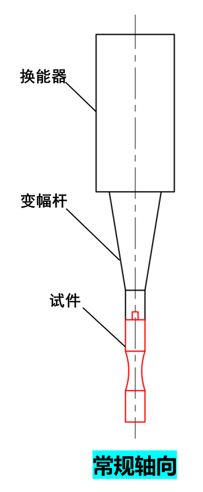
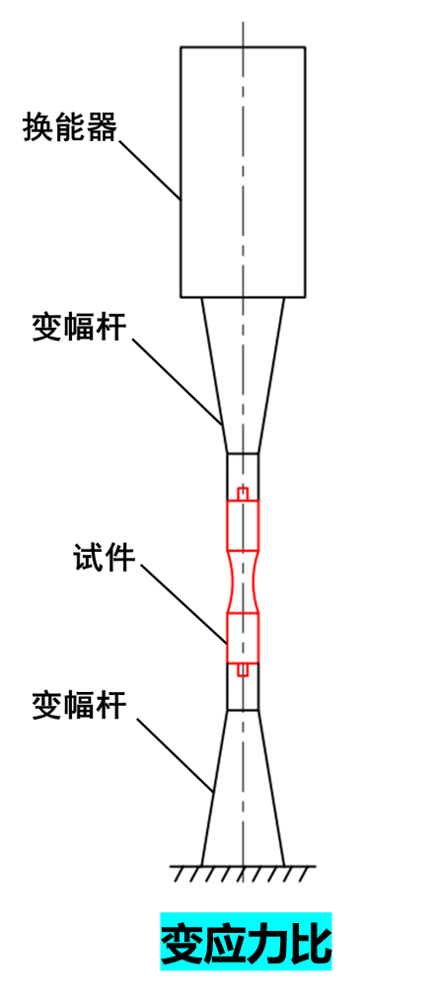
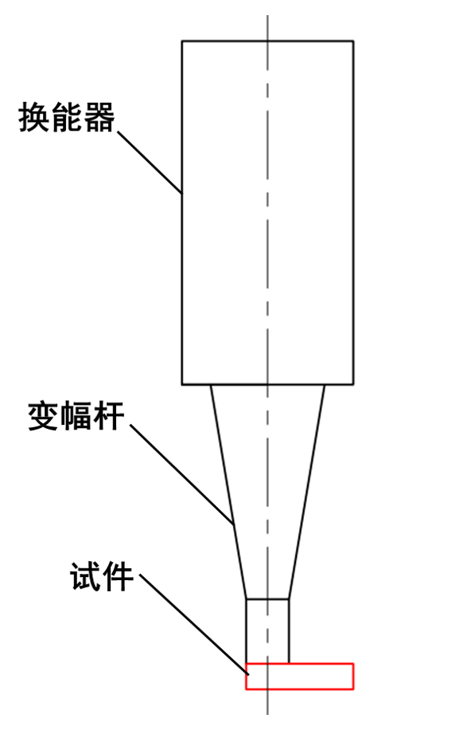

# 软件需求说明书

## 1. 简介

简要介绍软件的背景、目标和范围。

超高周疲劳控制系统是一款用于材料疲劳试验验证自动化的软件，主要用于材料疲劳试验数据的采集、分析和报告生成。
将多个原厂设备的数据采集、分析和报告生成整合到一个系统软件中，提高了工作效率，减少了人为错误。

通过继承多个原厂设备的能力组合，超高周疲劳控制系统 具有更强的适应性和扩展性。

整体需求目标:

- **整合万测静载机 1.0和2.0版本和赫兹声电2000C超声波发生器，以及用户试验流程的自定义功能。**
- **按照试验流程和用户在试验过程中的需求进行阐述，提供试验设计、试验执行、试验数据分析和报告生成等关键功能点整合**

## 2. 功能需求

### 2.1 硬件功能需求

### 2.1.1 静载机设备

#### 2.1.1.1 万测静载机 1.0

万测静载机 1.0是一款用于金属材料疲劳试验的设备，原厂设备能力具有以下能力：

- 通过串口接口与计算机通信，实现数据采集和控制。
- 支持多种试验模式，如拉伸、压缩、弯曲等。
- 支持多种加载方式，如恒载、循环载等。
- 支持多种加载控制方式，如位移控制、力控制等。
- 支持多种数据采集方式，如应变片、位移传感器等。

#### 2.1.1.2 万测静载机 2.0

万测静载机 2.0是一款用于金属材料疲劳试验的设备，原厂设备能力具有以下能力：

- 继承万测静载机 1.0的所有功能。
- 设备增加网络接口，支持远程控制和数据采集。
- 设备增加更多的试验模式和加载方式。
- 优化SDK接口，方便用户快速开发集成。

### 2.1.2 静载机设备功能需求

静载机设备功能需求按照试验流程和用户在试验过程中的需求进行阐述。

- 原厂设备的基础通信能力，设备地址配置，打开，读写，关闭等。
- 静载机的位移控制功能，包括【静载机上升】、【静载机下降】、【静载机停止】命令操作。
- 静载机设备的数据采集功能，包括位移、力等数据采集。
- 原厂静载机不同版本的设备控制集成，包括万测静载机 1.0和2.0版本。1.0版本的10KN和20KN两种传感器设备，2.0版本的网络配置。
- 对原厂静载机设备软件的集成，包括万测静载机 1.0和2.0版本原厂软件的集成。
- 原厂设备软件使用过程中的异常处理，包括设备通信异常、设备数据异常， 设备控制异常，设备数据采集异常，实际设备状态与软件状态不一致等异常情况的处理。

### 2.1.3 超声波发生器

#### 2.1.3.1 赫兹声电2000C超声波发生器

赫兹声电2000C超声波发生器是一款用于金属材料超声波检测的设备，原厂设备具有以下能力：

- 通过串口接口与计算机通信，实现数据采集和控制。
- 基于超声波能力，提供相应的串口通信协议，方便用户开发集成。
- 支持多种超声波检测模式，如超声波发射、超声波接收等。
- 支持多种超声波检测参数设置，如超声波频率、超声波振幅等。

#### 2.14 超声波发生器功能需求

超声波发生器功能需求按照试验流程和用户在试验过程中的需求进行阐述。

- 原厂设备的基础通信能力，设备地址配置，打开，读写，关闭等。
- 超声波发生器的振幅控制功能，包括【振幅校准】通过手动填写振幅和功率值，拟合振幅和功率值线性关系，实现振幅校准功能。
- 超声波发生器设备的数据采集功能，包括超声波频率、超声波振幅等数据采集。
- 对原厂超声波发生器设备软件使用过程中的异常处理，包括设备通信异常、设备数据异常， 设备控制异常，设备数据采集异常，实际设备状态与软件状态不一致等异常情况的处理。

### 2.2 软件功能需求

软件功能需求按照试验流程和用户在试验过程中的需求进行阐述。

整体试验流程：

- 试验设计
- 试验执行
- 试验结束

**软件整体功能需求根据客户需求和试验流程进行划分，分为【试验设计】、【试验执行】、【静载机测试】三个模块。**

能够满足用户对于材料疲劳试验的需求，提供试验设计、试验执行、试验数据分析和报告生成等功能。

运行在Windows 7+操作系统，支持串口通信和网络通信，支持多种试验设备的接入。

**长时间稳定运行。**

#### 2.2.1 试验设计

试验设计是用于材料基础信息的录入，包括材料名称、弹性模量、密度、 试验类型等。

通过试验设计，用户可以方便的进行试验参数的设置，试验设计的保存和导入导出。

通过材料基础信息的录入，方便用户后续试验数据的分析和报告生成，生成的报告中包含材料基础信息。

**通过相应试验设计算法推导2000C超声波发生器需要提供的试验振幅、频率等参数，为后续实验流程【试验执行】中驱动2000C红外振动频率提供基础设备参数。**

试验设计结构示意图如下：

- **三点弯曲疲劳试验**

  说明：

  三点弯曲疲劳试验是一种常用的金属材料疲劳试验方法，用于评估材料的疲劳性能。

  三点弯曲疲劳试验设计算法原理图如下：
  
- 轴向对称拉压疲劳试验

  示意图:
  

- 可调应力比轴向拉压疲劳试验

  示意图:
  

- 振动弯曲疲劳试验

  示意图:
  

软件功能需求：

- 试验设计分类选择。
- 材料基础信息录入。
- 试验参数设置编辑。
- 试验振幅、频率等参数推导。
- 试验设计保存。
- 试验设计导入导出。
- 试验设计管理，查询，删除。

#### 2.2.2 试验执行

软件功能需求：

试验执行是用于试验的实际操作，包括【设备开关】【设备准备】、【试验准备】、【试验实施】及 串口设备基础通信能力，设备地址配置，打开，读写，关闭等。

【设备开关】:

设备开关是用于设备的开关操作，包括【静载机开关】、【超声波发生器开关】等。使用设备开关，用户可以方便的控制设备的开关操作，实现设备的开关控制功能。

具体功能需求如下：

- 通过串口接口与万测静载机通信，实现静载机的准备工作，包括设备初始化、参数设置、数据采集基础通信。
- 通过串口接口与赫兹声电2000C超声波发生器通信，实现超声波发生器的准备工作，包括设备初始化、参数设置、数据采集基础通信。

【设备准备】:

设备准备是用于设备的准备工作，包括【设备开关】、【设备初始化】、【设备参数设置】、【设备数据采集】等。

具体功能需求如下：

- 静载机设备位移控制，包括【静载机上升】、【静载机下降】、【静载机停止】命令操作，实现静载机的位移控制功能，快速准确的控制静载机的位移，达到【试验准备】的位置条件。
- **【振幅校准】通过手动填写振幅和功率值，拟合振幅和功率值线性关系，实现振幅校准功能。用于控制超声波发生器的功率输出，实现超声波发生器的振幅控制功能。**
- **【试验参数设置】，通过软件设置试验参数，实现试验参数的设置功能，用于试验实施的试验参数设置。**

静载机设备功能需求：

静载机设备功能需求按照试验流程和用户在试验过程中的需求进行阐述。

- 原厂设备的基础通信能力，设备地址配置，打开，读写，关闭等。通讯协议为rs485转串口，以串口方式通信。
- 静载机位移控制功能，适用于静载机距离试件平台较远时，通过软件控制静载机的位移，实现静载机的位移控制功能。
- 静载机力控制功能，适用于静载机距离试件平台较近时，通过软件控制静载机的力，实现静载机的力控制功能。
- 静载机数据采集功能，包括位移、力等数据采集，用于试验过程中的数据采集和数据分析。
- 静载机设备软件使用过程中的异常处理，包括设备通信异常、设备数据异常， 设备控制异常，设备数据采集异常，实际设备状态与软件状态不一致等异常情况的处理。
- 静载机设备的控制集成，包括万测静载机 1.0和2.0版本，1.0版本的10KN和20KN两种传感器设备，2.0版本的网络配置。

【试验准备】:

试验准备是用于试验的准备工作，包括【静载机清零】、【循环次数清零】、【静载机保载】等。

具体功能需求如下：

- **【静载机清零】清除静载机的位移和力数据，实现静载机的数据清零功能，标定当前的位置为起始相对位置。**
- **【静载机保载】通过软件设置保载时长，静载机力控情况下，达到目标力值，持续保持目标力值的时长，实现静载机的保载控制功能，用于【试验实施】前的保载功能。**
- **【循环次数清零】清除循环次数和上一次的2000C超声发生器试验记录数据，实现循环次数清零和试验数据记录功能，用于试验完成后的数据文件存储。**

【试验实施】:

试验实施是用于试验的实际操作，包括【开始试验】、【暂停试验】、【继续试验】、【停止试验】等。
主要采集超声波发生器的数据。

- **【开始试验】，开始试验，启动静载机和超声波发生器，静载机按照【静载机保载】的设置的力值和保载时长进行试验，超声波发生器按照【振幅校准】的振幅和功率值和试验条件进行试验。**
- **【暂停试验】，暂停试验，暂停静载机和超声波发生器的试验，用于试验过程中的修改试验参数。**
- **【继续试验】，继续试验，继续静载机和超声波发生器的试验，用于暂停试验后的继续试验。**
- **【停止试验】，停止实验，停止静载机设备工作，停止超声波发生器设备工作，用于试验结束后的设备停止，数据采集和数据自动保存。**

#### 2.2.3 静载机测试

软件功能：
用于静载机设备调试验证，用于设备的基础通信能力，设备地址配置，打开，读写，关闭等信息展现。

## 3. 非功能需求

软件的性能、安全性、可维护性等非功能需求。

### 3.1 性能

- 系统响应时间：系统的响应时间应该在1秒以内。
- 系统数据处理能力：系统的数据处理能力应该支持每秒最大处理能力10条数据的处理，基于设备的采样能力。
- 系统稳定性：系统的稳定性应该保证系统的正常运行，系统的异常情况应该有相应的处理机制。

### 3.2 安全性

- 用户权限管理：系统应该支持用户权限管理，不同的用户有不同的权限。
- 数据加密：系统的数据传输应该支持数据加密，保证数据的安全性。不在一期范围内。
- 数据备份：系统的数据备份应该支持定时备份和手动备份。
- 试验数据存储：试验数据存储应该支持每次试验数据的存储，数据存储的格式应该支持csv格式和txt格式。

### 3.3 可维护性

- 系统日志：系统应该支持日志记录，记录系统的操作日志和异常日志。
- 系统升级：系统应该支持离线，覆盖升级，特殊情况可以替换升级，做好前期试验数据备份情况下。
- 试验异常终止：系统应该支持试验异常终止，试验异常终止后，系统应该有相应的处理机制。
