# 软件设计文档

## 1.1 概述

<!--主要介绍背景与上下文，包括时间、地点、人物、方案、备选方案等-->

### 1.1.1 背景

超声波发生器超高周疲劳控制系统是一款用于超声波发生器超高周疲劳试验的系统。 通过整合超声波发生器和静载机原厂设备数字化控制监测SDK，实现试验过程中各个阶段数据的连续性，数据一致性，及试验数据记录，报告生成等一系列自动化流程。

针对试验作业流程用户需求，简化了原厂设备操作流程，提高了试验效率，减少了试验操作人员的操作难度。

系统的主要功能如下：

- 试验设计：试验设计功能模块，用户输入材料基础信息，设计参数，试验设计算法计算试验设计结果，试验振幅，频率等参数。
- 试验执行：试验执行功能模块，用户进行试验准备，试验实施，试验结束，试验数据存储，试验报告生成等功能。
- 静载机测试：静载机测试功能模块，用户进行静载机设备准备，静载机设备位移控制，静载机设备力控制等功能。
- 超声波发生器：超声波发生器功能模块，用户进行超声波发生器设备准备，超声波发生器设备试验模式设置，超声波发生器设备数据采集，数据表格和直方图展示等功能。
- 试验数据存储查询：试验数据存储查询功能模块，用户进行试验数据存储，查询，导出，报告生成等功能。

### 1.1.2 目的

本文档主要用于描述超声波发生器超高周疲劳控制系统的系统设计，包括系统的功能模块划分，技术选型，技术架构，技术实现等内容。

### 1.1.3 范围

本文档主要用于描述超声波发生器超高周疲劳控制系统的系统设计，包括系统的功能模块划分，技术选型，技术架构，技术实现等内容。

### 1.1.4 定义

- 超声波发生器：超声波发生器是一种用于超声波发生的设备，用于超声波发生器超高周疲劳试验。
- 静载机：静载机是一种用于静载机试验的设备，用于静载机试验。
- 试验设计：试验设计是一种用于试验设计的功能模块，用户输入材料基础信息，设计参数，试验设计算法计算试验设计结果，试验振幅，频率等参数。

## 1.2 技术选型

- 硬件平台:

  硬件环境：PC机，x86 x86_64, 串口设备，网络设备。
- 操作系统平台：

  系统平台：`Windows7+`
- 软件平台：

  开发语言：`C/C++`, `C#`

  开发工具：`Visual Studio 2015`, `.NET Framework 3.5+`。

  数据库：`sqlite3`

  通信协议：串口通信协议，RS485转USB2.0+，网络通信协议（TCP/IP)。

  SDK：超声波发生器SDK，静载机设备SDK。
- 技术架构：

  采用`MVC`架构模式，`Model`层负责数据存储，`View`层负责数据展示，`Controller`层负责数据控制。
- 技术实现：

  采用`C++`语言实现，`C#`语言实现。
- 技术点：

  串口通信协议，网络通信协议，数据存储，数据查询，数据导出，报告生成。

## 1.3 软件架构

系统功能模块划分如下：

- 基础功能模块。
- 试验设计功能模块。
- 静载机设备功能模块。
- 超声波发生器设备控制模块。
- 试验数据文件管理模块。

模块示意图如下：

````mermaid
graph TD
    A[超声波发生器超高周疲劳控制系统] -->B[基础功能模块]
    A -->C[试验设计功能模块]
    A -->D[静载机设备功能模块]
    A -->E[超声波发生器设备功能模块]
    A -->F[试验数据文件管理功能模块]
````

### 1.3.1 基础功能模块

#### 设备读写基础子模块

静载机设备打开，关闭，参数设置，数据读取等功能。

流程示意图如下：


超声发生器设备打开，关闭，参数设置，数据读取等功能。

流程示意图如下：

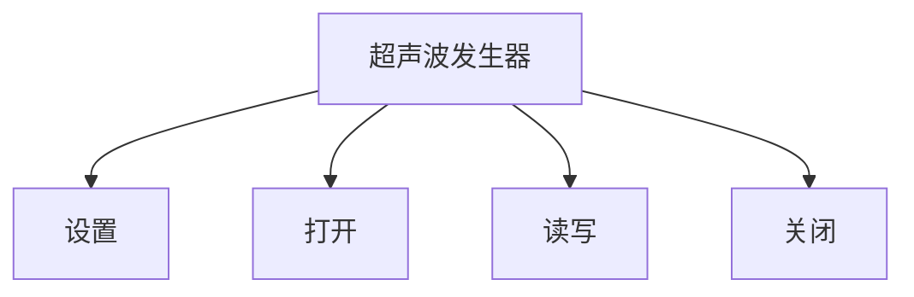

#### log日志子模块

系统运行日志，设备日志，试验日志等功能。

#### 数据存储子模块

采用sqlite3数据库，
试验数据存储，查询，导出，报告生成等功能。

#### xml配置文件子模块

xml格式存储系统配置文件，设备配置文件，试验配置文件等功能。

#### 试验报告生成子模块

采用word文档生成试验报告功能。采用word文档模板，填充试验数据，生成试验报告。
使用`C#`技术栈实现。

### 1.3.2 试验设计模块

试验设计的修改，保存，读取。

流程示意图如下：


试验名称，基础参数，试验参数的配置读取和用户输入。

试验设计的算法实现，通过算法结果为试验设备提供控制参数等功能。

流程示意图如下：


- 静载机设备控制模块

静载机设备的位移控控制，力控制等功能。

设备的位移控制，力控制，保载参数设置等功能系统持久化。

流程示意图如下：

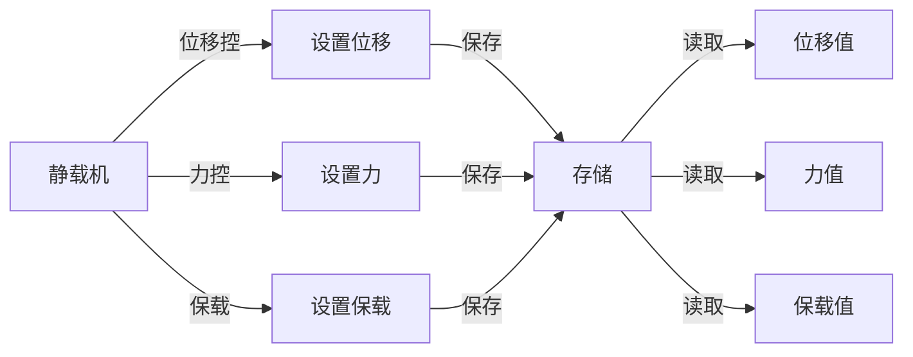

位移控制，力控制，保载等设备动作交互信息，设备写入和读取，设备事件监控。

流程示意图如下：


- 超声波发生器设备控制模块

间歇性设置，持续性设置，数据采集设置，数据表格记录设置，数据直方图展示设置等功能配置系统持久化。

流程示意图如下：

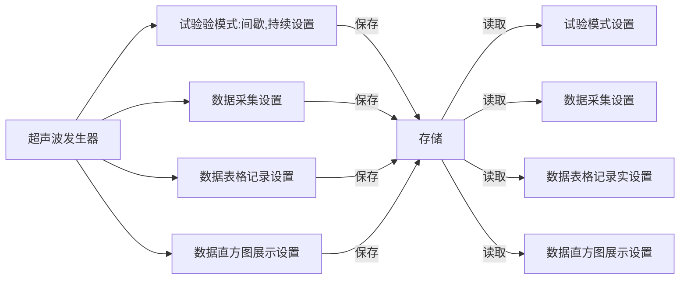

试验进行前，超声波发生器的试验模式设置，模式加载。

试验进行中，超声波发生器的实时监控，数据采集，数据表格和直方图展示。

试验结束，数据记录文件cvs文件导出。

流程示意图如下：

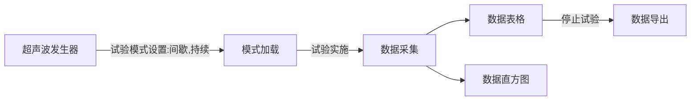

时序示意图如下：

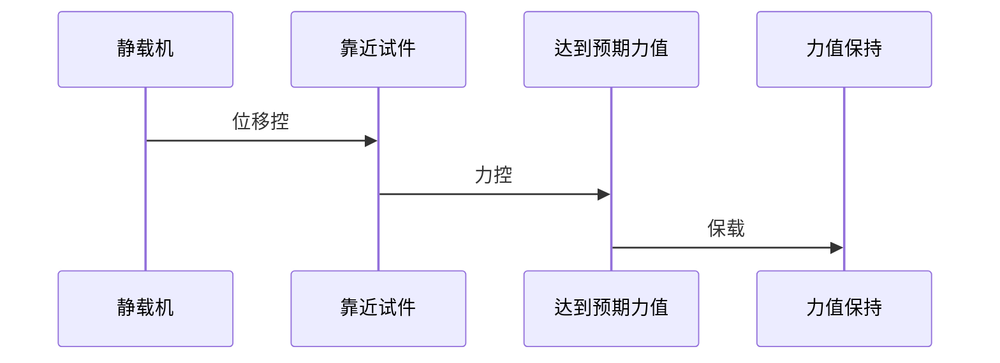

- 试验数据存储查询模块

  试验数据存储查询模块主要负责试验数据cvs文件记录的存储，查询，导出，报告生成等功能。

流程示意图如下：


## 1.4 软件设计

### 1.4.1 基础模块

- 设备读写基础子模块

接口定义：

```c++
class DeviceComListener {
public:
    virtual void onOpen() = 0;
    virtual void onClose() = 0;
    virtual void onRead() = 0;
    virtual void onWrite() = 0;
};
```

```c++
class DeviceNode {
public:
};
```

```c++
class DeviceComInterface : public DeviceNode {
public:
    virtual bool open() = 0;
    virtual bool close() = 0;
    virtual bool read() = 0;
    virtual bool write() = 0;
    void setListener(DeviceComListener* listener);
};
```

- log日志子模块

接口定义：

```c++
class Log {
public:
    void log(const char* msg);
};
```

- 数据存储子模块

接口定义：

```c++
class DataStorage {
public:
    virtual int32_t open(const url) = 0;
    virtual void query() = 0;
    virtual void close() = 0;
};
```

```c++
class DataStorageImpl : public DataStorage {
public:
    int32_t open(const url) override;
    void query() override;
    void close() override;
};
```

### 1.4.2 试验设计模块

接口定义：

```c++
// @brief 试验设计头部
// @brief The ExpDesignHeader struct
// 试验设计头部 exp design header
struct ExpDesignHeader {
}
```

```c++
// @brief 试验设计基础参数
// 试验设计基础参数
// 弹性模量、密度、应力最大值、应力比
// 作为试验输入参数经过计算后得到设计参数结果
// @brief The ExpDesignBaseParam struct
// exp design base param
// elastic modulus, density, max stress, stress ratio
// as the input parameter of the experiment, the design
// parameter result is obtained after calculation
struct ExpDesignBaseParam {
}
```

```c++
// @brief 试验设计参数 作为试验设计的输入参数
// @see kSolutionName_Axially_Symmetrical ...etc
// @brief The ExpDesignParamAxially struct as the
// input parameter of the experiment design
// @see kSolutionName_Axially_Symmetrical ...etc
struct ExpDesignParamAxially : public ExpDesignBaseParam {
}
```

```c++
// @brief 试验设计参数 作为试验设计的输入参数
// @see kSolutionName_Stresses_Adjustable ...etc
// @brief The ExpDesignParamStressesAdjustable struct as the
// input parameter of the experiment design
// @see kSolutionName_Stresses_Adjustable ...etc
struct ExpDesignParamStressesAdjustable : public ExpDesignBaseParam {
}
```

```c++
// @brief 试验设计参数 作为试验设计的输入参数
// @see kSolutionName_Th3point_Bending ...etc
// @brief The ExpDesignParamTh3pointBending struct as the
// input parameter of the experiment design
// @see kSolutionName_Th3point_Bending ...etc
struct ExpDesignParamTh3pointBending : public ExpDesignBaseParam {
}
```

```c++
// @brief 试验设计参数 作为试验设计的输入参数
// @see kSolutionName_Vibration_Bending ...etc
// @brief The ExpDesignParamVibrationBending struct as the
// input parameter of the experiment design
// @see kSolutionName_Vibration_Bending ...etc
struct ExpDesignParamVibrationBending : public ExpDesignBaseParam {
}
```

```c++
// @brief 试验设计结果, 作为试验设计的输出参数
// 基础结构体，用于扩展。
// @brief The ExpDesignResult struct as the output
// parameter of the experiment design. The basic structure
// is used for extension.

struct ExpDesignResult {
}
```

```c++
struct ExpDesignResult0 : public ExpDesignResult {
}
```

```c++
struct ExpDesignResult1 : public ExpDesignResult {
}
```

```c++
/// @brief 试验设计参数计算结果 作为试验设计的输出参数
/// @brief as the output parameter of the experiment design
/// 轴向对称拉伸试验设计结果
/// Axially symmetrical tensile test design result
struct ExpDesignResultAxially : public ExpDesignResult1 { }
```

```c++
/// @brief 试验设计参数计算结果 作为试验设计的输出参数
/// @brief as the output parameter of the experiment design
/// 可调应力试验设计结果
/// Adjustable stress test design result
struct ExpDesignResultStressesAdjustable : public ExpDesignResult1 {}
```

```c++
/// @brief 试验设计参数计算结果 作为试验设计的输出参数
/// @brief as the output parameter of the experiment design
/// 三点弯曲试验设计结果
/// Three-point bending test design result
struct ExpDesignResultTh3pointBending : public ExpDesignResult1 {
}
```

```c++
/// @brief 试验设计参数计算结果 作为试验设计的输出参数
/// @brief as the output parameter of the experiment design
/// 振动弯曲试验设计结果
/// Vibration bending test design result
struct ExpDesignResultVibrationBending : public ExpDesignResult1 {
}
```

### 1.4.3 静载机设备控制模块

接口定义：

```c++
struct stload_api {
    int32_t (*open)();
    int32_t (*close)();
    int32_t (*setDisplacement)();
    int32_t (*setForce)();
    int32_t (*setHoldForce)();
};
```

#### 2.4.4 超声波发生器设备控制模块

接口定义：

```c++
class UltraDevice : public DeviceNode {
public:
    explicit UltraDevice(DeviceComInterface* com_port_device);

public:
    int32_t Open();
    void Close();
    void StartUltra();
    void StopUltra();
    void SetUltraMode();
    void SetUltraPower();
    void SetUltraFrequency();
};
```

#### 2.4.5 试验数据存储查询模块

接口定义：

```c++
class ExpDataStorage {
public:
    virtual int32_t Open(const char* url) = 0;
    virtual void Query() = 0;
    virtual void Close() = 0;
};
```

```c++
class ExpDataStorageImpl : public ExpDataStorage {
public:
    int32_t Open(const char* url) override;
    void Query() override;
    void Close() override;
};
```

## 1.5 架构设计

软件的总体架构设计如下：

- 试验设计模块：用于试验设计的功能模块。
- 试验执行模块：用于试验执行的功能模块。
- 静载机测试模块：用于静载机测试的功能模块。

软件的主要组件如下：

- 试验设计组件：用于试验设计的组件。

  主要包括:

  试验设计界面，振幅校准用于试验设计算法。
- 试验执行组件：用于试验执行的组件。

  主要包括：

  视图组件：数据采集图表，数据采集表格，试验参数设置界面，试验执行界面。

  控制组件：试验开始，试验暂停，试验继续，试验停止。

  数据处理组件：试验数据处理展现。
- 静载机测试组件：用于静载机测试的组件。

  主要包括:

  静载机测试界面，静载机测试数据采集。
- 串口通信组件：用于串口通信的组件。

  主要包括：

  静载机： 通信地址配置，静载机通信打开，静载机通信读写，静载机通信关闭。

  2000C：  超声波发生器通信地址配置，2000C超声波发生器通信打开，2000C超声波发生器通信读写，2000C超声波发生器通信关闭。
- 网络通信组件：用于网络通信的组件。

  主要包括：

  静载机2.0：  静载机通信地址配置，静载机通信打开，静载机通信读写，静载机通信关闭。
- 数据库组件：用于数据库操作的组件。用于试验数据的存储和查询。用于试验数据报表的生成。

  主要包括：

  数据库连接，数据库操作，数据库查询，数据库存储。
- 日志组件：用于日志记录的组件。用户不可见，软件运行时记录日志。

  主要包括：

  日志记录，日志查询，日志存储。用于软件的操作日志和异常日志的记录。
- 异常处理组件：用于异常处理的组件。用户不可见，软件运行时记录异常。

  主要包括：

  异常捕获，异常处理，异常记录。用于软件的异常情况的处理。
- 试验报告生成组件：用于试验报告生成的组件。试验报告模板，试验报告生成。

  主要包括：

  试验报告模板，试验报告生成，试验报告导出，试验报告程序todocx。

### 1.5.1 架构设计原则

软件的设计应该遵循以下原则：
采用 MVC 设计模式，将软件的功能分为 Model（数据模型）、View（视图）、Controller（接口控制） 三个部分，实现功能的分离和解耦。

- 模块化：软件的功能模块应该独立，模块之间的耦合度应该尽量降低。
- 可扩展：软件的功能应该支持扩展，新的功能模块应该容易添加。
- 可维护：软件的代码应该易于维护，代码的可读性和可维护性应该高。
- 可测试：软件的功能应该易于测试，测试用例应该覆盖所有的功能模块。

### 1.5.2 架构框架

流程示意图如下：

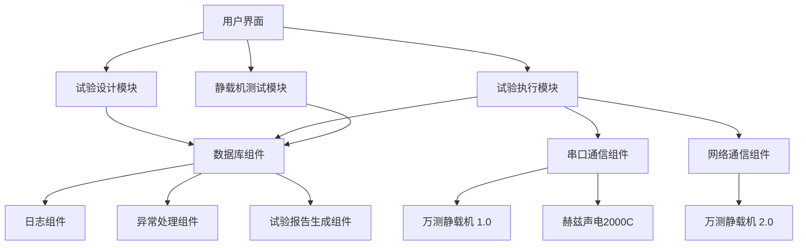

## 2. 模块设计

### 2.1 试验设计模块

试验设计模块的功能、接口和内部结构。

#### 2.1.1 数据结构模型接口定义

三点弯曲疲劳试验为例，试验设计模块的功能如下：

输入：

1. 材料基础信息，设计参数。
2. 振幅校准数据，拟合振幅和功率值线性关系。

算法：

1. 三点弯曲疲劳试验设计算法。

输出：

1. 试验设计结果，试验振幅，频率等参数。算法计算结果用于试验执行2000C超声波发生器的试验参数设置。

流程示意图如下：

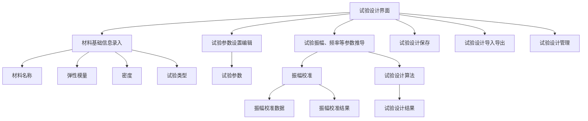

数据流程如下：

1. 用户输入材料基础信息，设计参数。
2. 用户输入振幅校准数据，拟合振幅和功率值线性关系。
3. 试验设计算法计算试验设计结果，试验振幅，频率等参数。
4. 试验设计结果用于试验执行2000C超声波发生器的试验参数设置。

流程示意图如下：

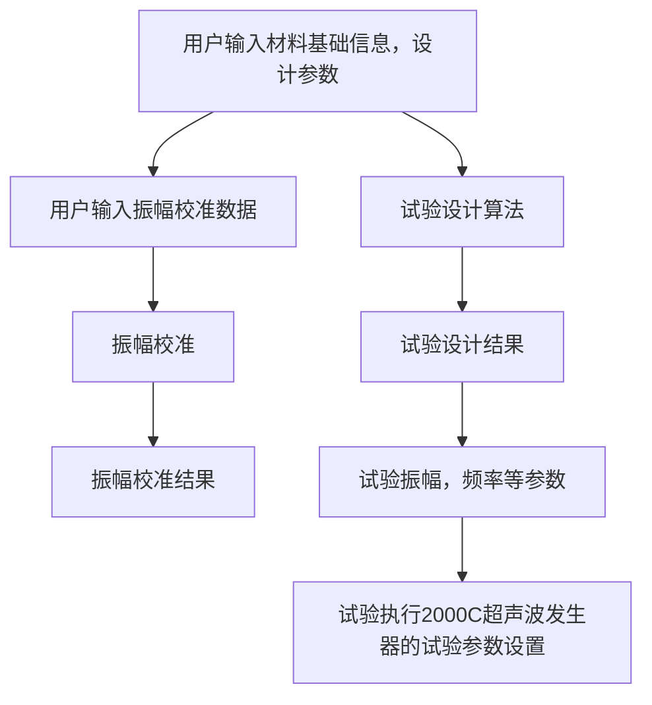

振幅校准数据接口设计如下：

- 振幅校准数据拟合线性函数：y = kx + b，其中 **y 为功率值，x 为振幅值**。
- **y 功率值用于超声波发生器的功率输出，x 振幅值用于超声波发生器的振幅控制**。
- 拟合函数采用最小二乘法，拟合结果为振幅和功率值的线性关系。
- 拟合结果用于试验设计算法的振幅和功率值的推导。
- 试验设计算法接口定义

```cpp
// @brief 振幅校准拟合函数
// @brief Amplitude calibration fitting function
// @param x 振幅值
// @param y 功率值
// @param n 数据点个数
// @param a 拟合结果斜率
// @param b 拟合结果截距
void LineFit(float x[], float y[], int n, float* a, float* b);
```

#### 2.1.2 试验设计存储方式

试验设计存储方式以xml格式存储，试验设计头信息，试验设计基础参数，试验设计结果等信息存储。

已文件存储方式存储，文件名以试验设计名称命名，文件后缀为xml。

软件支持试验设计的导入导出，用户可以通过试验设计的导入导出功能，方便的进行试验设计的保存和恢复。

三点弯曲疲劳试验，试验设计存储方式如下：

```xml
<?xml version="1.0" encoding="utf-8"?>
<solution>
    <header>
        <solution_type>2</solution_type>
        <version>1</version>
        <name>三点试样名称</name>
    </header>
    <base_param>
        <material_name></material_name>
        <elastic_modulus>116.000000</elastic_modulus>
        <density>4379.000000</density>
        <max_stress>730.000000</max_stress>
        <stress_ratio>0.500000</stress_ratio>
    </base_param>
    <result type="th3point">
        <f_theory_eamplitude>28.300000</f_theory_eamplitude>
        <f_theory_dc_stress_MPa>6.450000</f_theory_dc_stress_MPa>
        <f_eamplitude>28.340000</f_eamplitude>
        <f_dc_stress_MPa>6.440000</f_dc_stress_MPa>
        <f_static_load_MPa>547.500000</f_static_load_MPa>
        <f_specimen_width_B>10.000000</f_specimen_width_B>
        <f_specimen_thickness_h>4.000000</f_specimen_thickness_h>
        <f_specimen_length_L>31.700000</f_specimen_length_L>
        <f_support_distance_L0>17.260000</f_support_distance_L0>
    </result>
</solution>
```

轴向对称拉压疲劳试验，试验设计存储方式如下：

```xml
<?xml version="1.0" encoding="utf-8"?>
<solution>
    <header>
        <solution_type>0</solution_type>
        <version>1</version>
        <name>轴向试样名称</name>
    </header>
    <base_param>
        <material_name>钛合金</material_name>
        <elastic_modulus>116.000000</elastic_modulus>
        <density>4379.000000</density>
        <max_stress>208.000000</max_stress>
        <stress_ratio>-1.000000</stress_ratio>
    </base_param>
    <result type="axially">
        <f_eamplitude>15.000000</f_eamplitude>
        <f_dc_stress_MPa>13.570000</f_dc_stress_MPa>
        <f_exp_section_radius_R2>5.000000</f_exp_section_radius_R2>
        <f_parallel_section_radius_R1>1.500000</f_parallel_section_radius_R1>
        <f_transition_section_radius_R0>22.300000</f_transition_section_radius_R0>
        <f_transition_section_length_L1>12.000000</f_transition_section_length_L1>
        <f_parallel_section_length_L0>2.000000</f_parallel_section_length_L0>
        <f_exp_section_length_L2>15.000000</f_exp_section_length_L2>
    </result>
</solution>
```

可调应力比轴向拉压疲劳试验，试验设计存储方式如下：

```xml
<?xml version="1.0" encoding="utf-8"?>
<solution>
    <header>
        <solution_type>1</solution_type>
        <version>1</version>
        <name>可调试样名称</name>
    </header>
    <base_param>
        <material_name>铝合金</material_name>
        <elastic_modulus>116.000000</elastic_modulus>
        <density>4379.000000</density>
        <max_stress>900.000000</max_stress>
        <stress_ratio>0.350000</stress_ratio>
    </base_param>
    <result type="stresses">
        <f_eamplitude>20.800000</f_eamplitude>
        <f_dc_stress_MPa>14.060000</f_dc_stress_MPa>
        <f_exp_section_radius_R2>5.000000</f_exp_section_radius_R2>
        <f_parallel_section_radius_R1>1.500000</f_parallel_section_radius_R1>
        <f_transition_section_radius_R0>22.000000</f_transition_section_radius_R0>
        <f_transition_section_length_L1>11.900000</f_transition_section_length_L1>
        <f_parallel_section_length_L0>1.700000</f_parallel_section_length_L0>
        <f_exp_section_length_L2>15.700000</f_exp_section_length_L2>
        <f_static_load_MPa>607.500000</f_static_load_MPa>
    </result>
</solution>

```

振动弯曲疲劳试验，试验设计存储方式如下：

```xml
<?xml version="1.0" encoding="utf-8"?>
<solution>
    <header>
        <solution_type>3</solution_type>
        <version>1</version>
        <name>振动试样名称</name>
    </header>
    <base_param>
        <material_name></material_name>
        <elastic_modulus>116.000000</elastic_modulus>
        <density>4379.000000</density>
        <max_stress>208.000000</max_stress>
        <stress_ratio>-1.000000</stress_ratio>
    </base_param>
    <result type="vibration">
        <f_eamplitude>8.500000</f_eamplitude>
        <f_dc_stress_MPa>24.500000</f_dc_stress_MPa>
        <f_specimen_length_parallel_section_L1>3.700000</f_specimen_length_parallel_section_L1>
        <f_specimen_radius_arc_R1>3.000000</f_specimen_radius_arc_R1>
        <f_specimen_radius_transition_R2>1.000000</f_specimen_radius_transition_R2>
        <f_thickness_clamping_d1>5.200000</f_thickness_clamping_d1>
        <f_thickness_exp_section_L0_d2>3.200000</f_thickness_exp_section_L0_d2>
    </result>
</solution>

```

### 2.2 试验执行模块

试验执行模块

试验执行模块的功能、接口和内部结构。

试验执行模块的功能如下：

- 设备准备：静载机设备地址配置，打开，读写配置。 2000C设备地址配置，打开，读写配置。 静载机设备位移控制。
- 试验准备：静载机清零，循环次数清零，静载机保载。
- 试验实施：开始试验，暂停试验，继续试验，停止试验。
- 试验结束：试验数据存储，试验报告生成。

试验执行流程示意图如下：

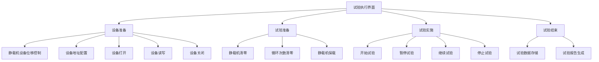

#### 3.2.1 设备准备

设备准备接口设计实现原则：

- 设备对象接口类。设备接口设计应该支持多种设备的接入，包括静载机设备和超声波发生器设备。
- 设备通信接口类。设备通信接口应该支持串口通信和网络通信，支持设备的打开，读写，关闭等操作。
- 设备静载机辅助方法类。设备辅助方法应该支持设备的初始化，销毁释放，位移控制，清零，保载等操作。
- 设备超声波发生器辅助方法类。设备辅助方法应该支持设备的c初始化，销毁释放，振幅校准，功率控制等操作。

设备准备结构流程示意图如下：

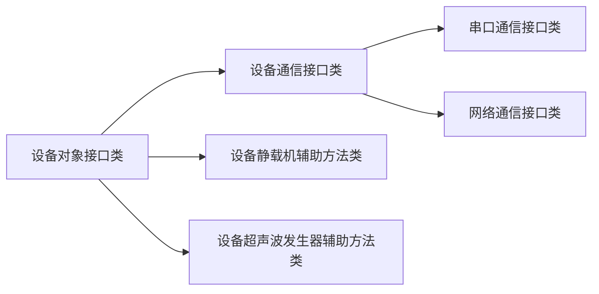

#### 3.2.2 试验准备

试验准备接口设计实现原则：

- 试验准备接口类。试验准备接口设计应该支持试验的准备，包括静载机设备的清零，静载机设备位移控制，静载机设备力控制，静载机设备的保载，2000C循环次数试验数据清除等操作。
- 试验准备辅助方法类。试验准备辅助方法应该支持试验的初始化，销毁释放，静载机设备的清零，静载机设备位移控制，静载机设备力控制，静载机设备的保载，2000C循环次数试验数据清除等操作。

试验准备结构示意图如下：


静载机设备清零：

功能描述如下：

- 静载机清零功能，清零静载机设备最近一次的位移，力等数据。·
- 静载机清零功能，标记当前位置为零点，力为零点。

静载机设备清零函数实现如下：

```cpp
// @brief 静载机清零
// @brief The static load machine zero
// @return int32_t 0 success, non-zero fail
int32_t StaticAircraftZero();
```

静载机位移控，力控函数实现如下：

```cpp
// @brief 静载机力控，位移控制，方向下
// @brief The static load machine force control, displacement control, direction down
// @return int32_t 0 success, non-zero fail
int32_t StaticAircraftDoMoveDown();
// @brief 静载机力控，位移控制，方向上
// @brief The static load machine force control, displacement control, direction up
// @return int32_t 0 success, non-zero fail
int32_t StaticAircraftDoMoveUp();
```

静载机保载功能说明如下：

保载数据结构如下：

```cpp
// @brief 保载数据结构
// @brief The hold load data struct
struct DeviceLoadStatic {
  /// @brief direct 0: none, 1: up, 2: down, 3: left, 4: right
  /// @brief 0: 无方向, 1: 上, 2: 下, 3: 左, 4: 右
  int32_t direct_;
  /// @brief  control type 0: load, 1: extn, 2: posi
  /// @brief 0: 负载, 1: 位移, 2: 位置
  int32_t ctrl_type_;
  /// @brief speed
  /// @brief 速度 unit: mm/s 或者 N/s
  float speed_;
  /// @brief threshold
  /// @brief 阈值 unit: N 或者 mm
  float threshold_;
  /// @brief retention
  /// @brief 保持力 unit: N
  float retention_;
  /// @brief  displacement unit: mm
  /// @brief 位移 unit: mm
  float displacement_;
  /// @brief keep_load_duration in seconds unit: second
  /// @brief 保载时长 unit: 秒
  float keep_load_duration_;
};
```

结合三点弯曲疲劳试验说明如下：

- 以位移控方式调用StaticAircraftDoMoveDown接近试样。
- 以力控方式调用StaticAircraftDoMoveDown，达到目标保载力。
- 以时间方式保载力保持一段时间，用于目标保载力保持时长。

静载机保载流程示意图如下：


2000C设备循环次数清零：

功能描述如下：

- 2000C设备循环次数清零功能，清零2000C设备最近一次的试验循环次数。
- 2000C设备循环次数清零功能，当前循环次数为零点。

2000C设备循环次数清零函数实现如下：

```cpp
// @brief 2000C设备循环次数清零
// @brief The 2000C device cycle number zero
// @return int32_t 0 success, non-zero fail
int32_t UltraDeviceCycleNumberZero();
```

#### 3.2.3 试验实施

试验实施接口设计实现原则：

- 试验实施接口类。试验实施接口设计应该支持试验的开始，暂停，继续，停止等操作。
- 试验实施辅助方法类。试验实施辅助方法应该支持试验的初始化，销毁释放，试验的开始，暂停，继续，停止等操作。

试验实施结构示意图如下：


试验开始，暂停，继续，停止函数实现如下：

```cpp
// @brief 试验开始
// @brief The exp start
// @return int32_t 0 success, non-zero fail
int32_t ExpStart();

// @brief 试验暂停
// @brief The exp pause
// @return int32_t 0 success, non-zero fail
int32_t ExpPause();

// @brief 试验继续
// @brief The exp continue
// @return int32_t 0 success, non-zero fail
int32_t ExpResume();

// @brief 试验停止
// @brief The exp stop
// @return int32_t 0 success, non-zero fail
int32_t ExpStop();
```

试验实施流程示意图如下：


#### 3.2.4 试验结束

试验结束接口设计实现原则：

- 试验结束接口类。试验结束接口设计应该支持试验的数据存储，试验报告生成等操作。
- 试验结束辅助方法类。试验结束辅助方法应该支持试验的数据存储，试验报告生成等操作。

试验结束结构示意图如下：


试验数据存储，试验报告生成函数实现如下：

```cpp
// @brief 试验数据存储
// @brief The exp data store
// @return int32_t 0 success, non-zero fail
int32_t ExpDataStore();

// @brief 试验报告生成
// @brief The exp report generate
// @return int32_t 0 success, non-zero fail
int32_t ExpReportGenerate();
```

试验结束流程示意图如下：

```mermaid
graph LR
    A[试验数据读取] --> |格式转换|B[试验报告生成]
    B -->|数据存储|C[试验数据存储]
```

### 2.3 试验数据模块

试验数据模块的功能、接口和内部结构。

试验数据涉及试验进行中的2000C采样信息集合，2000C直方图采样集合，试验停止2000C采样集合转换为csv文件和xml试验信息文件。试验中间数据文件转换为word报告文件。

1. 采样信息集合表：2000C采样信息集合表，存储试验进行中的2000C采样信息集合。
2. 直方图采样集合表：2000C直方图采样集合表，存储试验进行中的2000C直方图采样集合。
3. 试验数据文件：存储试验停止2000C采样集合转换为csv文件和xml试验信息文件用于试验结果信息的存储中间数据文件。
4. 试验报告文件：将存储试验中间数据文件转换为word报告文件用于试验报告的生成。

试验数据模块的功能如下：

- 试验数据表创建：创建试验数据表，用于试验数据的存储。
- 试验数据存储：试验数据存储到SQLite数据库中，用于试验数据的查询和中间数据文件csv，报告生成。
- 试验数据查询：试验数据查询，支持试验数据的查询和中间数据文件csv，csv文件导出，文件名已试验开始和结束时间命名。
- 试验数据报告：试验数据报告生成，csv数据文件通过todocx导出到docx文件中。

试验数据存储流程示意图如下：

```mermaid
graph LR
    A[试验数据存储] --试验开始--> B[试验数据数据采集sqlite存储]
    B --试验结束--> C[试验数据csv导出]
    B --试验结束--> D[试验数据xml导出]
    C --> E[试验数据报告生成]
    D --> E
```

试验数据sqlite表创建接口设计如下：

```cpp
// @brief 试验数据表创建
// @brief The exp data table create
// @return int32_t 0 success, non-zero fail
int32_t ExpDataTableCreate();
```

试验数据sqlite查询接口设计如下：

```cpp
// @brief 试验数据查询sqlite
// @brief The exp data query
// @param start_time 试验开始时间
// @param end_time 试验结束时间
// @return int32_t 0 success, non-zero fail
int32_t ExpDataQuery(const int64_t start_time, const int64_t end_time);
```

试验数据存储接口设计如下：

```cpp
// @brief 试验数据存储条目到sqlite数据库白哦中
// @brief The exp data store
// @param data 试验数据
// @return int32_t 0 success, non-zero fail
int32_t ExpDataStore(const ExpData& data);
```

试验数据csv导出接口设计如下：

```cpp
// @brief 试验数据csv导出
// @brief The exp data csv export
// @param data 试验数据
// @return int32_t 0 success, non-zero fail
int32_t ExpDataCsvExport(const list<ExpData>& data);
```

试验数据报告生成接口设计如下：

```cpp
// @brief 试验数据报告生成
// @brief 试验数据报告生成
// @param data 试验数据csv文件
// @return int32_t 0 success, non-zero fail
int32_t ExpReportGenerate(const string& data);
```

数据库的结构、主要表和关系。

数据库设计如下：

- 数据库名称：anxi.db
- 数据表：试验数据表，试验直方图表。

### 2.4 试验数据采样表

试验数据采样表设计如下：

```sql
CREATE TABLE exp_data_list (
    id INTEGER PRIMARY KEY AUTOINCREMENT,
    cycle INTEGER,
    kHz REAL,
    MPa REAL,
    μm REAL,
    date REAL);
```

试验数据直方图采样表设计如下：

```sql
CREATE TABLE exp_data_histogram (
    id INTEGER PRIMARY KEY AUTOINCREMENT,
    cycle INTEGER,
    kHz REAL,
    MPa REAL,
    μm REAL,
    date REAL);
```

2 表数据字段相同。分别用于试验数据采样列表和直方图采样。

表数据字段说明如下：

- id：数据编号，自增长。
- cycle：试验循环次数。
- kHz：超声波频率。
- MPa：静载机力。
- μm：静载机位移。
- date：数据采样时间。

### 2.5 试验采样数据存储

试验采样数据存储采用csv格式存储。以文件形式存储在本地磁盘中。

规则定义如下：

- 试验采样数据存储采用csv格式存储，以文件形式存储在本地磁盘中。

- 对当前试验数据采样表数据进行csv导出，文件名已试验开始和结束时间命名。

- 试验信息以xml格式存储，以文件形式存储在本地磁盘中。

- 对当前试验总体信息进行xml导出，文件名已试验开始和结束时间命名, 与试验数据csv文件名相同。

csv 数据文件模板如下：

```csv
cycle,kHz,MPa,μm,date
1,20.0,0.0,0.0,2021-08-01 12:00:00
2,20.0,0.0,0.0,2021-08-01 12:00:01
3,20.0,0.0,0.0,2021-08-01 12:00:02
4,20.0,0.0,0.0,2021-08-01 12:00:03
5,20.0,0.0,0.0,2021-08-01 12:00:04
```

csv 数据文件字段说明如下：

- cycle：试验循环次数。
- kHz：超声波频率。
- MPa：静载机力。
- μm：静载机位移。
- date：数据采样时间。

xml 试验信息文件模板如下：

```xml
<?xml version="1.0" encoding="utf-8"?>
 <ExperimentReport>
     <StartTime>2022-01-01 12:00:00</StartTime>
     <EndTime>2022-01-01 13:00:00</EndTime>
     <ExperimentName>Sample ExperimentReport</ExperimentName>
     <ElasticModulus>100 GPa</ElasticModulus>
     <Density>2.7<Density>
     <MaxStress>100</MaxStress>
     <RatioOfStress>0.5</RatioOfStress>
     <CycleCount>1000</CycleCount>
     <BottomAmplitude>10</BottomAmplitude>
 </ExperimentReport>
```

### 2.6 试验报告 DOCX 转换工具

- 设计原则：采用命令行工具，通过命令行调用，将csv文件转换为docx文件。
- 设计模式：采用单例模式，保证只有一个实例。
- 设计接口：支持csv文件转换为docx文件。
- 设计实现：采用docx模板文件，将csv文件数据填充到docx模板文件中，生成docx文件。

数据流程示意图如下：

```mermaid
graph LR
    A[用户试验csv数据文件] --> B[试验报告生成工具]
    A1[用户试验xml信息文件] --> B
    A2[用户试验docx模板文件] --> B
    B --> C[docx文件]
```

- 试验报告 DOCX 数据存储采用docx格式存储。以文件形式存储在本地磁盘中。

- 对用户试验csv数据文件通过todocx导出到docx文件中，文件名已试验开始和结束时间命名，文件路径采用当前日期命名。

- docx 报告模板文件

三点应力比疲劳试验报告模板如下：

模板名称: 3th_report_template.docx

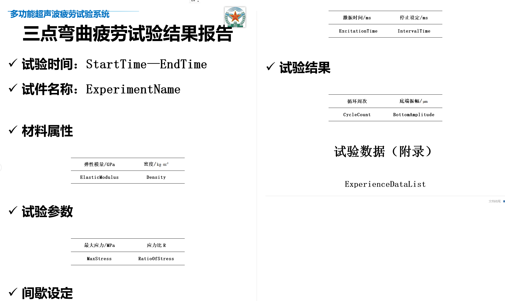

数据标签说明如下：

| 标签               | 说明         |
| ------------------ | ------------ |
| StartTime          | 试验开始时间 |
| EndTime            | 试验结束时间 |
| ExperimentName     | 试件名称     |
| MaxStress          | 最大应力     |
| RatioOfStress      | 应力比       |
| ExcitationTimes    | 激励时间     |
| Intervaltime       | 间隔时间     |
| CycleCount         | 循环次数     |
| BottomAmplitude    | 底端振幅     |
| ExperienceDataList | 试验数据列表 |

报告生成工具：todocx

安装位置：与软件安装在同一目录下。

工具使用：命令行工具，通过命令行调用，将csv文件转换为docx文件。

MSOfficeSDK: 支持word2007+版本。
