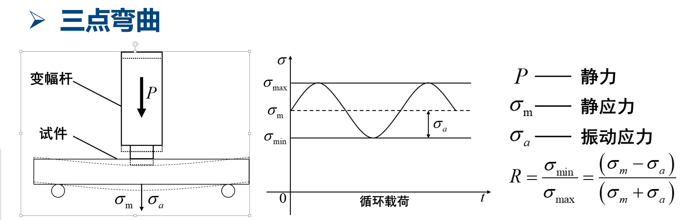

# 软件技术说明书

## 1. 简介
简要介绍软件的背景、目标和范围。

anxi软件是一款用于材料疲劳试验验证自动化的软件，主要用于材料疲劳试验数据的采集、分析和报告生成。将多个原厂设备的数据采集、分析和报告生成整合到一个系统软件中，提高了工作效率，减少了人为错误。

通过继承多个原厂设备的能力组合，anxi软件具有更强的适应性和扩展性。

第一阶段整合万测静载机 1.0和2.0版本和赫兹声电2000C超声波发生器，以及用户试验流程的自定义功能。

## 2. 功能需求

### 2.1 硬件原厂设备能力简介

#### 2.1.1 万测静载机 1.0

- 万测静载机 1.0是一款用于金属材料疲劳试验的设备，具有以下能力：
  - 通过串口接口与计算机通信，实现数据采集和控制。
  - 支持多种试验模式，如拉伸、压缩、弯曲等。
  - 支持多种加载方式，如恒载、循环载等。
  - 支持多种加载控制方式，如位移控制、力控制等。
  - 支持多种数据采集方式，如应变片、位移传感器等。

#### 2.1.2 万测静载机 2.0

- 万测静载机 2.0是一款用于金属材料疲劳试验的设备，具有以下能力：
    - 设备增加了网络接口，支持远程控制和数据采集。
    - 设备增加了更多的试验模式和加载方式。
    - 优化SDK接口，方便用户快速开发集成。

#### 2.1.3 赫兹声电2000C超声波发生器

- 赫兹声电2000C超声波发生器是一款用于金属材料超声波检测的设备，具有以下能力：
    - 通过串口接口与计算机通信，实现数据采集和控制。
    - 基于超声波能力，提供相应的串口通信协议，方便用户开发集成。
    - 基于串口通信协议和用户试验需求，拓展间歇试验和持续试验功能。

### 2.2 软件功能需求

软件功能需求按照试验流程和用户在试验过程中的需求进行阐述。

整体试验流程：

- 试验设计
- 试验准备
- 试验执行
- 试验结束

#### 2.2.1 试验设计

简介: 试验设计是用于材料基础信息的录入，包括材料名称、弹性模量、密度、 试验类型等。
通过材料基础信息的录入，方便用户后续试验数据的分析和报告生成，生成的报告中包含材料基础信息。
推导2000C超声波发生器需要提供的试验振幅、频率等参数。

试验设计分类：

- 三点弯曲疲劳试验

  
- 轴向对称拉压疲劳试验
- 可调应力比轴向拉压疲劳试验
- 振动弯曲疲劳试验

试验设计功能：

- 试验设计分类选择
- 材料基础信息录入
- 试验参数设置
- 试验振幅、频率等参数推导
- 试验设计保存
- 试验设计导入导出
- 试验设计删除

试验流程功能

1. 试验静载机 1.0和2.0的试验流程，包括试验准备、试验执行、试验结束等。

- 通过串口接口与万测静载机 1.0通信，实现静载机的准备工作，包括设备初始化、参数设置、数据采集基础通信。

- 通过静载机设备位移控制，实现静载机的位移控制功能，快速准确的控制静载机的位移。

- 通过静载机设备力控制，实现静载机的力控制功能，快速准确的控制静载机的力。

- 通过静载机设备保载控制，实现静载机的保载控制功能按软件设置时长，快速准确的控制静载机的保载功能。

2. 试验超声波发生器的试验流程，包括试验准备、试验执行、试验结束等。

数据采集、数据分析和报告生成。

- 
#### 2.2.1 万测静载机 1.0 试验控制

- 支持万测静载机 1.0的试验控制功能，包括位移控，力控，保载。
详细描述软件的功能需求和用户需求。

#### 2.2.2 三点弯曲疲劳试验控制

- 支持三点弯曲疲劳试验的控制功能，包括加载、卸载和数据采集。
- 通过传感器采集弯曲试验中的力和位移数据。
- 支持多种加载模式，如恒载、循环载等。
- 支持试验参数的设置和调整，如加载速度、加载次数等。
- 生成试验报告，包含试验过程数据和结果分析。

## 3. 非功能需求
列出软件的性能、安全性、可维护性等非功能需求。

## 4. 系统架构
描述软件的总体架构和主要组件。

## 5. 模块设计
### 5.1 模块一
描述模块一的功能、接口和内部结构。

### 5.2 模块二
描述模块二的功能、接口和内部结构。

// ...其他模块...

## 6. 数据库设计
描述数据库的结构、主要表和关系。

## 7. 接口设计
列出软件对外提供的API接口及其详细说明。

## 8. 安全性
描述软件的安全性考虑和实现方法。

## 9. 性能优化
列出软件性能优化的策略和措施。

## 10. 测试计划
描述软件的测试策略、测试用例和测试流程。

## 11. 部署计划
描述软件的部署环境和部署流程。

## 12. 维护和扩展
说明软件的维护策略和未来的扩展计划。

## 13. 附录
提供相关的附加信息，如术语表、参考资料等。
